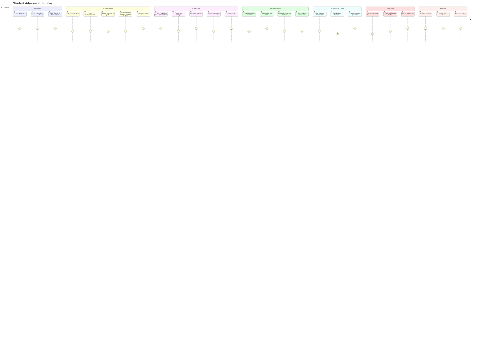

# AI Admission Counsellor - Complete Project Plan & SRS

**Project Title:** AI Admission Counsellor – One Platform for Complete College Admission Guidance in India  
**Version:** 1.0  
**Date:** July 2026  
**Version:** 1.0  
**Status:** Planning Phase  

---

## 1. PROBLEM ANALYSIS

### 1.1 Problem Statement

Every year, **2.5+ million students** across India appear for entrance examinations including:
- **National Level:** JEE Main, JEE Advanced, NEET UG, CUET
- **State Level:** MHT-CET, WBJEE, KCET, AP EAMCET, TS EAMCET, COMEDK, MHT-CET, GUJCET, etc.
- **University Level:** BITSAT, VITEEE, SRMJEEE, MU OET, etc.

### 1.2 Key Pain Points

| # | Pain Point | Impact |
|---|------------|--------|
| 1 | **Eligibility Uncertainty** | Students don't know which colleges they qualify for based on rank/percentile/category |
| 2 | **Manual Research** | Students visit 50-100+ college websites manually |
| 3 | **Expensive Counselling** | Private counsellors charge ₹50,000 - ₹2,00,000+ |
| 4 | **Missed Deadlines** | Students miss counselling registration, choice filling, reporting dates |
| 5 | **Reservation Complexity** | Complex state-wise, category-wise, quota-wise seat matrices |
| 6 | **Scholarship Blindness** | 70%+ eligible students don't apply for scholarships |
| 7 | **Document Confusion** | Missing/incomplete documents cause admission rejection |
| 8 | **College Comparison Difficulty** | No unified comparison across fees, placements, cutoffs, facilities |
| 9 | **Misleading Advice** | Unverified agents/consultants provide misleading information |
| 10 | **Language Barrier** | Non-English speakers struggle with English-only platforms |

### 1.3 Impact Quantification
- **Time Wasted:** 50-100 hours per student on manual research
- **Money Wasted:** ₹50,000 - ₹2,00,000 on private counselling
- **Opportunity Cost:** 15-20% students miss better colleges due to misinformation
- **Mental Stress:** High anxiety during admission season (June-August)

---

## 2. PROPOSED SOLUTION

### 2.1 Vision Statement
> **"India's most comprehensive AI-powered admission counselling platform that democratizes access to quality admission guidance, empowering every student to make informed decisions and secure their rightful college seat."**

### 2.2 Solution Overview

**AI Admission Counsellor** is a full-stack, AI-powered web platform that serves as a **complete digital admission counsellor** for Indian students across all major entrance exams. The platform combines:

| Component | Technology | Purpose |
|-----------|-----------|---------|
| **AI/ML Engine** | Python, TensorFlow/PyTorch, scikit-learn | Cutoff prediction, probability scoring, recommendation engine |
| **Data Engine** | PostgreSQL + Redis + Elasticsearch | Historical cutoffs, seat matrix, college data, scholarships |
| **AI Assistant** | LLM (GPT-4/Claude/Llama) + RAG | Natural language counselling, multilingual chat |
| **Frontend** | Next.js 14+, React 18, Tailwind CSS | Modern, responsive, accessible UI |
| **Backend** | Node.js (NestJS) / FastAPI | REST + GraphQL APIs, WebSocket for real-time |
| **Auth & Auth** | NextAuth.js / Auth0 + OTP | Role-based access, OTP auth, JWT |
| **Storage** | AWS S3 / Cloudflare R2 | Secure document storage |
| **Search** | Elasticsearch / Meilisearch | College search, semantic search |
| **Notifications** | Firebase/Novu/OneSignal | Push, Email, SMS, WhatsApp |
| **AI/ML** | Python microservices + Vector DB | ML predictions, RAG chatbot, embeddings |

---

## 3. FEATURE BREAKDOWN

### 3.1 Module 1: AI Student Profile Builder

#### 3.1.1 Data Collection Fields

| Category | Fields | Validation |
|----------|--------|------------|
| **Personal** | Name, Gender, Date of Birth, Category (Gen/EWS/OBC/SC/ST), PwD Status, Defence Quota, Minority Status | Mandatory + Dropdown validation |
| **Academic** | Exam Appeared (Multi-select), Rank, Percentile, Marks, 12th Board, 12th %, 10th % | Range validation per exam |
| **Location** | Home State, Domicile State, Preferred States (Multi), Preferred Cities (Multi) | State/UT dropdowns |
| **Preferences** | Preferred Branches (Multi), College Type (Govt/Pvt/Deemed/IIT/NIT/IIIT/GFTI), Budget Range (Min-Max), Hostel Required (Y/N), Language Preference | Multi-select with search |
| **Financial** | Family Income, EWS Certificate, Fee Budget Range | Income slab dropdown |
| **Documents** | Document checklist tracker, Upload status | Checklist + Upload status |

#### 3.1.2 Profile Completion Wizard
- **Step 1:** Basic Info (Exam, Rank, Category)
- **Step 2:** Preferences (Branch, Location, Budget)
- **Step 3:** Documents (Checklist + Upload)
- **Step 3:** Preferences (Branch, Location, Budget)
- **Progress Indicator:** Visual progress bar with completion %

### 3.2 Module 2: AI College Prediction Engine

#### 3.2.1 Prediction Engine Architecture

```
┌─────────────────────────────────────────────────────────────────┐
│                     AI PREDICTION ENGINE                        │
├─────────────────────────────────────────────────────────────────┤
│  Input Layer                                                     │
│  ┌─────────────┐ ┌─────────────┐ ┌─────────────┐ ┌───────────┐  │
│  │ Student     │ │ Historical  │ │ Seat Matrix │ │ Reservation│  │
│  │ Profile     │ │ Cutoffs     │ │ (Year-wise) │ │ Rules      │  │
│  └──────┬──────┘ └──────┬──────┘ └──────┬──────┘ └─────┬──────┘  │
│         │             │                │              │          │
│         └─────────────┴────────────────┴──────────────┘          │
│                           │                                        │
│                    ┌──────▼──────┐                                 │
│                    │  Feature    │                                 │
│                    │  Engineering│                                 │
│                    └──────┬──────┘                                 │
│                           │                                        │
│              ┌────────────┼────────────┐                           │
│              ▼            ▼            ▼                           │
│       ┌────────────┐ ┌───────────┐ ┌──────────┐                   │
│       │ Gradient   │ │ Random    │ │ Neural   │                   │
│       │ Boosting   │ │ Forest    │ │ Network  │                   │
│       │ (XGBoost)  │ │           │ │ (MLP)    │                   │
│       └─────┬──────┘ └─────┬─────┘ └────┬─────┘                   │
│             │              │            │                          │
│             └──────────────┼────────────┘                          │
│                            ▼                                        │
│                   ┌────────────────┐                               │
│                   │ Ensemble       │                               │
│                   │ Voting/Stacking│                               │
│                   └───────┬────────┘                               │
│                           ▼                                        │
│                   ┌────────────────┐                               │
│                   │ Probability    │                               │
│                   │ Calibration    │                               │
│                   │ (Platt/Isotonic)│                              │
│                   └───────┬────────┘                               │
│                           ▼                                        │
│                   ┌────────────────┐                               │
│                   │ Output:        │                               │
│                   │ - Safe (≥80%)  │                               │
│                   │ - Moderate     │                               │
│                   │   (40-80%)     │                               │
│                   │ - Dream (<40%) │                               │
│                   │ - Probability% │                               │
│                   └────────────────┘                               │
└─────────────────────────────────────────────────────────────────┘
```

#### 3.2.2 Prediction Features

| Feature Category | Features |
|------------------|----------|
| **Student Features** | Rank, Percentile, Marks, Category, Gender, Home State, Domicile, PwD, Defence, EWS, Minority, Income |
| **College Features** | Institute Type, State, City, NIRF Rank, NIRF Score, Total Seats, Branch, Fee, Placement Avg, Accreditation |
| **Historical Features** | Cutoff (Round 1-6, Last 5 years), Trend (YoY change), Volatility, Round-wise movement |
| **Reservation Features** | Category-wise seats, State quota %, All India quota %, Special quotas |
| **Derived Features** | Rank vs Cutoff gap, Percentile vs Cutoff percentile, Category rank vs General rank, Home state advantage |

#### 3.2.3 Prediction Output Categories

| Category | Probability Range | Color Code | Action Guidance |
|----------|------------------|------------|-----------------|
| **Safe** | ≥ 80% | 🟢 Green | "Apply confidently, high chance of admission" |
| **Moderate** | 40% - 79% | 🟡 Yellow | "Good chance, keep as preference 1-3" |
| **Dream** | 20% - 39% | 🟠 Orange | "Possible if cutoffs drop, keep as dream choice" |
| **Reach** | < 20% | 🔴 Red | "Very low probability, consider as backup only" |

#### 3.2.4 Model Training Pipeline

```
Data Sources → ETL Pipeline → Feature Store → Model Training → Model Registry → Model Serving
     │              │              │              │              │              │
     ▼              ▼              ▼              ▼              ▼              ▼
┌─────────┐   ┌───────────┐  ┌──────────┐  ┌───────────┐  ┌───────────┐  ┌──────────┐
│ JoSAA   │   │ Airflow/  │  │ Feast/   │  │ MLflow +  │  │ MLflow    │  │ FastAPI  │
│ JoSAA   │──▶│ Prefect   │──▶│ Tecton   │──▶│ Optuna    │──▶│ Model     │──▶│ + Triton │
│ CSAB    │   │           │  │          │  │           │  │ Registry  │  │ Inference│
│ State   │   │           │  │          │  │           │  │           │  │ Server   │
│ CETs    │   │           │  │          │  │           │  │           │  │          │
└─────────┘   └───────────┘  └──────────┘  └───────────┘  └───────────┘  └──────────┘
```

#### 3.2.5 Model Versioning & Monitoring

| Aspect | Implementation |
|--------|----------------|
| **Versioning** | MLflow Model Registry with staging/production stages |
| **Monitoring** | Evidently AI for data drift, Prometheus/Grafana for performance |
| **Retraining** | Automated monthly retraining with new cutoff data |
| **A/B Testing** | Gradual rollout with 10/50/100% traffic split |
| **Explainability** | SHAP values for prediction explanations |

### 3.3 Module 3: Complete College Database

#### 3.3.1 College Data Schema

```sql
-- Core College Table
CREATE TABLE colleges (
    id UUID PRIMARY KEY DEFAULT gen_random_uuid(),
    name VARCHAR(500) NOT NULL,
    short_name VARCHAR(100),
    university_id UUID REFERENCES universities(id),
    approval_bodies TEXT[], -- AICTE, NMC, UGC, PCI, COA, etc.
    institute_type VARCHAR(50), -- IIT, NIT, IIIT, GFTI, State Govt, Private, Deemed
    nirf_rank_2024 INTEGER,
    nirf_score_2024 DECIMAL(5,2),
    naac_grade VARCHAR(10),
    nba_accredited BOOLEAN,
    
    -- Location
    state_id UUID REFERENCES states(id),
    city_id UUID REFERENCES cities(id),
    address TEXT,
    pincode VARCHAR(10),
    latitude DECIMAL(10,8),
    longitude DECIMAL(11,8),
    google_maps_url TEXT,
    
    -- Campus
    campus_area_acres DECIMAL(10,2),
    campus_images TEXT[],
    virtual_tour_url TEXT,
    
    -- Contact
    website_url TEXT,
    email VARCHAR(255),
    phone VARCHAR(20),
    admission_email VARCHAR(255),
    admission_phone VARCHAR(20),
    
    -- Metadata
    established_year INTEGER,
    ownership_type VARCHAR(50), -- Government, Private, Deemed, Autonomous
    is_active BOOLEAN DEFAULT true,
    created_at TIMESTAMP DEFAULT NOW(),
    updated_at TIMESTAMP DEFAULT NOW()
);

-- Courses/Branches
CREATE TABLE courses (
    id UUID PRIMARY KEY DEFAULT gen_random_uuid(),
    college_id UUID REFERENCES colleges(id),
    name VARCHAR(200) NOT NULL,
    branch_code VARCHAR(20),
    degree_type VARCHAR(50), -- B.Tech, B.E., B.Arch, MBBS, BDS, etc.
    duration_years INTEGER DEFAULT 4,
    total_intake INTEGER,
    aiq_seats INTEGER, -- All India Quota
    state_quota_seats INTEGER,
    fees_per_year DECIMAL(12,2),
    hostel_fees_per_year DECIMAL(12,2),
    mess_fees_per_year DECIMAL(12,2),
    other_fees_per_year DECIMAL(12,2),
    is_active BOOLEAN DEFAULT true
);

-- Historical Cutoffs
CREATE TABLE cutoffs (
    id UUID PRIMARY KEY DEFAULT gen_random_uuid(),
    course_id UUID REFERENCES courses(id),
    year INTEGER NOT NULL,
    round INTEGER NOT NULL, -- 1-6, spot, special
    category VARCHAR(20), -- GEN, EWS, OBC, SC, ST, PwD
    quota_type VARCHAR(30), -- AIQ, State Quota, Deemed, etc.
    opening_rank INTEGER,
    closing_rank INTEGER,
    opening_percentile DECIMAL(7,4),
    closing_percentile DECIMAL(7,4),
    opening_marks INTEGER,
    closing_marks INTEGER,
    is_last_round BOOLEAN DEFAULT false,
    created_at TIMESTAMP DEFAULT NOW()
);

-- Seat Matrix
CREATE TABLE seat_matrix (
    id UUID PRIMARY KEY DEFAULT gen_random_uuid(),
    course_id UUID REFERENCES courses(id),
    year INTEGER NOT NULL,
    category VARCHAR(20) NOT NULL,
    quota_type VARCHAR(30) NOT NULL,
    total_seats INTEGER NOT NULL,
    filled_seats INTEGER DEFAULT 0,
    vacant_seats INTEGER GENERATED ALWAYS AS (total_seats - filled_seats) STORED
);

-- Placements
CREATE TABLE placements (
    id UUID PRIMARY KEY DEFAULT gen_random_uuid(),
    college_id UUID REFERENCES colleges(id),
    year INTEGER NOT NULL,
    branch_id UUID REFERENCES courses(id),
    total_students INTEGER,
    placed_students INTEGER,
    average_package DECIMAL(12,2),
    median_package DECIMAL(12,2),
    highest_package DECIMAL(12,2),
    top_recruiters TEXT[],
    placement_rate DECIMAL(5,2) GENERATED ALWAYS AS 
        (CASE WHEN total_students > 0 THEN (placed_students::decimal / total_students * 100) ELSE 0 END) STORED
);

-- Facilities
CREATE TABLE facilities (
    id UUID PRIMARY KEY DEFAULT gen_random_uuid(),
    college_id UUID REFERENCES colleges(id),
    category VARCHAR(50), -- Hostel, Library, Sports, Lab, Medical, Transport, etc.
    facility_name VARCHAR(200),
    description TEXT,
    is_available BOOLEAN DEFAULT true,
    capacity INTEGER,
    images TEXT[]
);
```

#### 3.3.2 Data Sources & Ingestion

| Data Type | Sources | Frequency | Method |
|-----------|---------|-----------|--------|
| **Cutoffs** | JoSAA, CSAB, State CET portals, JoSAA/CSAB PDFs | Annual (post-counselling) | PDF parsing + Manual verification |
| **Seat Matrix** | JoSAA, CSAB, State CET cell websites | Annual | PDF/Excel parsing + API where available |
| **College Info** | AICTE, NMC, UGC, NIRF, College websites | Quarterly | Web scraping + API + Manual |
| **Placements** | NIRF reports, College placement reports, TPO portals | Annual | PDF parsing + Manual entry |
| **Fees** | State fee regulatory committees, College websites | Annual | PDF/Web scraping |
| **Scholarships** | NSP, State portals, AICTE, UGC, Ministry websites | Quarterly | API + Web scraping |
| **Rankings** | NIRF, QS, THE, India Today, Outlook | Annual | PDF/Excel download |

#### 3.3.3 Data Quality Pipeline

```
┌─────────────┐    ┌──────────────┐    ┌────────────────┐    ┌──────────────┐
│ Raw Sources │───▶│ Raw Zone     │───▶│ Staging Zone   │───▶│ Curated Zone │
│ (PDF,Web,API)│   │ (S3/MinIO)   │   │ (PostgreSQL)   │   │ (PostgreSQL) │
└─────────────┘    └──────────────┘    └────────────────┘    └──────────────┘
                           │                    │                     │
                           ▼                    ▼                     ▼
                    ┌──────────────┐    ┌────────────────┐    ┌──────────────┐
                    │ Validation   │    │ Transformation │    │ Quality      │
                    │ Rules Engine │    │ & Enrichment   │    │ Monitoring   │
                    │ (Great       │    │ (dbt/SQLMesh)  │    │ (Great       │
                    │  Expectations)│   │                │    │  Expectations)│
                    └──────────────┘    └────────────────┘    └──────────────┘
```

### 3.4 Module 4: Admission Guidance System

#### 3.4.1 Counselling Process Coverage

| Counselling Body | Exams Covered | Rounds Covered |
|------------------|---------------|----------------|
| **JoSAA** | JEE Main, JEE Advanced | 6 Rounds + Spot Rounds |
| **CSAB** | JEE Main (NITs, IIITs, GFTIs) | Special Rounds |
| **MCC** | NEET UG (AIQ 15%, Deemed, Central) | 4 Rounds + Stray Vacancy |
| **State CET Cells** | MHT-CET, WBJEE, KCET, AP EAMCET, TS EAMCET, GUJCET, etc. | State-specific rounds |
| **State Medical** | State NEET UG counselling | State-specific |
| **Private/Deemed** | COMEDK, Uni-GAUGE, etc. | Institute-level rounds |

#### 3.4.2 Guidance Content Structure

```markdown
# Admission Guidance Structure (Per Counselling Body)

## 1. Overview
- What is this counselling?
- Who conducts it?
- Which colleges participate?
- Eligibility criteria

## 2. Registration Process
- Step-by-step registration guide
- Required documents for registration
- Registration fee & payment modes
- Important dates

## 3. Choice Filling Strategy
- How many choices to fill?
- Order of preference strategy
- Safe/Moderate/Dream college distribution
- Branch vs College priority
- Float/Freeze/Slide explanation with examples

## 4. Seat Allotment Process
- How allotment works
- Round-wise timeline
- Result checking process

## 5. Seat Acceptance & Reporting
- Freeze/Float/Slide options explained
- Seat acceptance fee payment
- Document verification process
- Physical vs Online reporting
- Upgradation rules

## 6. Spot/Stray Vacancy Rounds
- Eligibility
- Process
- Timeline

## 7. Important Dates Calendar
- Visual calendar with all key dates
- Reminders setup

## 8. Required Documents Checklist
- Category-wise document list
- Document specifications (format, size)
- Downloadable checklist PDF

## 9. FAQ Section
- Top 50 FAQs per counselling body
- Searchable FAQ

## 10. Video Guides (Future)
- Language: English, Hindi, Regional
- Chapter-wise videos
```

### 3.5 Module 5: Scholarship Finder

#### 3.5.1 Scholarship Categories & Sources

| Category | Sources | Examples |
|----------|---------|----------|
| **Central Govt** | NSP, AICTE, UGC, Ministry websites | Pragati, Saksham, PMSSS, Central Sector Scheme |
| **State Govt** | State scholarship portals | Maharashtra DBT, UP Scholarship, Karnataka ePASS, WBMDFC |
| **Minority** | MOMA, State Minority Commissions | Pre/Post Matric, Merit-cum-Means, Begum Hazrat Mahal |
| **Private/Corporate** | Company CSR, Foundation websites | Tata Trusts, Reliance Foundation, Aditya Birla, Kotak |
| **College-Specific** | College websites, Alumni associations | Merit scholarships, Need-based, Sports/Cultural |
| **Special Categories** | Various ministries | Defence, Single Girl Child, Differently-abled, Sports |

#### 3.5.2 Scholarship Data Schema

```sql
CREATE TABLE scholarships (
    id UUID PRIMARY KEY DEFAULT gen_random_uuid(),
    name VARCHAR(500) NOT NULL,
    short_name VARCHAR(100),
    provider VARCHAR(200),
    provider_type VARCHAR(50), -- Central, State, Private, College, Minority
    category VARCHAR(50), -- Merit, Need, Merit-cum-Means, Category-based, Special
    
    -- Eligibility
    eligible_categories TEXT[], -- GEN, EWS, OBC, SC, ST, PwD, Minority, etc.
    eligible_genders TEXT[], -- Male, Female, Transgender
    min_income_limit DECIMAL(12,2), -- Annual family income ceiling
    max_income_limit DECIMAL(12,2),
    min_academic_percentage DECIMAL(5,2),
    eligible_courses TEXT[], -- B.Tech, MBBS, B.Arch, etc.
    eligible_states TEXT[], -- State-specific or All India
    age_limit_min INTEGER,
    age_limit_max INTEGER,
    other_eligibility TEXT, -- JSON/text for complex rules
    
    -- Benefits
    benefit_type VARCHAR(50), -- Tuition fee, Maintenance, One-time, Laptop, etc.
    amount_min DECIMAL(12,2),
    amount_max DECIMAL(12,2),
    duration_years INTEGER,
    renewal_criteria TEXT,
    
    -- Application
    application_mode VARCHAR(50), -- Online, Offline, Both
    application_url TEXT,
    documents_required TEXT[],
    application_start_date DATE,
    application_end_date DATE,
    selection_process TEXT,
    
    -- Metadata
    is_active BOOLEAN DEFAULT true,
    is_verified BOOLEAN DEFAULT false,
    last_verified DATE,
    source_url TEXT,
    created_at TIMESTAMP DEFAULT NOW(),
    updated_at TIMESTAMP DEFAULT NOW()
);

-- Student-Scholarship Matching
CREATE TABLE student_scholarship_matches (
    id UUID PRIMARY KEY DEFAULT gen_random_uuid(),
    student_profile_id UUID REFERENCES student_profiles(id),
    scholarship_id UUID REFERENCES scholarships(id),
    match_score DECIMAL(5,2), -- 0-100%
    eligibility_status VARCHAR(30), -- Eligible, Conditionally Eligible, Not Eligible
    missing_documents TEXT[],
    matched_at TIMESTAMP DEFAULT NOW(),
    notified BOOLEAN DEFAULT false,
    applied BOOLEAN DEFAULT false
);
```

#### 3.5.3 Matching Algorithm

```python
def calculate_scholarship_match(student_profile, scholarship):
    """
    Calculate eligibility match score (0-100)
    """
    score = 0
    max_score = 0
    missing_docs = []
    
    # Category match (25 points)
    max_score += 25
    if student_profile.category in scholarship.eligible_categories:
        score += 25
    elif 'All' in scholarship.eligible_categories:
        score += 25
    
    # Income match (20 points)
    max_score += 20
    if scholarship.max_income_limit:
        if student_profile.family_income <= scholarship.max_income_limit:
            score += 20
        else:
            missing_docs.append("Income certificate showing income ≤ limit")
    else:
        score += 20  # No income limit
    
    # Academic match (15 points)
    max_score += 15
    if student_profile.percentage_12th >= scholarship.min_academic_percentage:
        score += 15
    else:
        missing_docs.append(f"12th % ≥ {scholarship.min_academic_percentage}%")
    
    # Course match (15 points)
    max_score += 15
    if student_profile.preferred_branch in scholarship.eligible_courses:
        score += 15
    elif 'All' in scholarship.eligible_courses:
        score += 15
    
    # State match (10 points)
    max_score += 10
    if student_profile.domicile_state in scholarship.eligible_states:
        score += 10
    elif 'All India' in scholarship.eligible_states:
        score += 10
    
    # Gender match (5 points)
    max_score += 5
    if student_profile.gender in scholarship.eligible_genders:
        score += 5
    elif 'All' in scholarship.eligible_genders:
        score += 5
    
    # Age match (5 points)
    max_score += 5
    age = calculate_age(student_profile.dob)
    if scholarship.age_limit_min <= age <= scholarship.age_limit_max:
        score += 5
    
    # Documents readiness (10 points)
    max_score += 10
    required_docs = set(scholarship.documents_required)
    uploaded_docs = set(student_profile.uploaded_documents)
    if required_docs.issubset(uploaded_docs):
        score += 10
    else:
        missing_docs.extend(list(required_docs - uploaded_docs))
    
    match_percentage = (score / max_score * 100) if max_score > 0 else 0
    
    return {
        'score': round(match_percentage, 2),
        'status': 'Eligible' if match_percentage >= 80 else 
                 'Conditionally Eligible' if match_percentage >= 50 else 'Not Eligible',
        'missing_documents': missing_docs
    }
```

### 3.6 Module 6: AI Admission Assistant (RAG Chatbot)

#### 3.6.1 Architecture

```
┌─────────────────────────────────────────────────────────────────────────────┐
│                         AI ADMISSION ASSISTANT ARCHITECTURE                 │
├─────────────────────────────────────────────────────────────────────────────┤
│                                                                             │
│  ┌──────────────┐     ┌──────────────┐     ┌──────────────┐                │
│  │   User       │     │   Intent     │     │   Context    │                │
│  │   Query      │────▶│   Classifier │────▶│   Retriever  │                │
│  │  (Multi-lang)│     │  (Intent +   │     │  (Hybrid:    │                │
│  └──────────────┘     │   Entities)  │     │   Vector +   │                │
│                       └──────┬───────┘     │   Keyword)   │                │
│                              │             └──────┬───────┘                │
│                              ▼                    ▼                        │
│  ┌──────────────┐     ┌──────────────┐     ┌──────────────┐              │
│  │  Response    │◀────│   LLM        │◀────│  Knowledge   │              │
│  │  Generator   │     │   (GPT-4/    │     │  Base        │              │
│  │  (Streaming) │     │   Claude/    │     │  (Vector DB  │              │
│  └──────────────┘     │   Llama 3)   │     │   + Graph)   │              │
│          │            └──────────────┘     └──────────────┘              │
│          ▼                   │                    │                       │
│  ┌──────────────┐           │                    │                       │
│  │  Response    │           ▼                    ▼                       │
│  │  Formatter   │    ┌──────────────┐     ┌──────────────┐              │
│  │  (Markdown,  │    │  Guardrails  │     │  Data Sources│              │
│  │   Citations, │    │  (Safety,    │     │  • College DB│              │
│  │   Actions)   │    │   Hallucin., │     │  • Cutoffs   │              │
│  └──────────────┘    │   PII)       │     │  • Counselling│             │
│          │           └──────────────┘     │  • Scholarships│            │
│          ▼                                  │  • Documents │              │
│  ┌──────────────┐                          │  • FAQs      │              │
│  │  User        │                          └──────────────┘              │
│  │  Interface   │                                   │                     │
│  │  (Chat UI)   │                                   ▼                     │
│  └──────────────┘                          ┌──────────────┐              │
│          │                                 │  Vector DB   │              │
│          ▼                                 │  (Pinecone/  │              │
│  ┌──────────────────┐                      │  Weaviate/   │              │
│  │  Feedback Loop   │                      │  pgvector)   │              │
│  │  (Thumbs up/down,│                      └──────────────┘              │
│  │   Corrections)   │                                        │             │
│  └──────────────────┘                                        ▼             │
│                                 ┌──────────────────────────────┐          │
│                                 │   Fine-tuning / RLHF Data    │          │
│                                 └──────────────────────────────┘          │
└─────────────────────────────────────────────────────────────────────────────┘
```

#### 3.6.2 Knowledge Base Structure

| Collection | Description | Embedding Model | Chunk Size |
|------------|-------------|-----------------|------------|
| `colleges` | College profiles, facilities, contacts | text-embedding-3-large | 512 tokens |
| `cutoffs` | Historical cutoffs, trends, analysis | text-embedding-3-large | 256 tokens |
| `counselling` | Process guides, rules, FAQs | text-embedding-3-large | 512 tokens |
| `scholarships` | Eligibility, process, deadlines | text-embedding-3-large | 512 tokens |
| `documents` | Document checklists, formats, samples | text-embedding-3-large | 256 tokens |
| `faqs` | Curated FAQs with verified answers | text-embedding-3-large | 256 tokens |
| `policies` | Govt notifications, notifications | text-embedding-3-large | 512 tokens |

#### 3.6.3 Multilingual Support Architecture

```
User Query (Any Language)
        │
        ▼
┌───────────────────┐
│ Language Detection │──▶ Hindi/Marathi/Bengali/Kannada/Telugu/Tamil/English
└───────────────────┘
        │
        ▼
┌───────────────────┐
│ Translation to    │ (If non-English)
│ English           │
└───────────────────┘
        │
        ▼
┌───────────────────┐
│ RAG Pipeline      │ (English KB)
│ (Retrieve + Gen)  │
└───────────────────┘
        │
        ▼
┌───────────────────┐
│ Translation to    │ (Back to user language)
│ User Language     │
└───────────────────┘
        │
        ▼
   Response
```

**Supported Languages:** English, Hindi (हिन्दी), Marathi (मराठी), Bengali (বাংলা), Kannada (ಕನ್ನಡ), Telugu (తెలుగు), Tamil (தமிழ்)

#### 3.6.4 Sample Conversation Flows

**Flow 1: College Prediction Query**
```
User: "I got 96 percentile in MHT CET. Which colleges should I apply to?"
AI: 
1. Detect intent: College Prediction + MHT CET
2. Extract entities: Exam=MHT CET, Percentile=96
3. Ask clarifying questions:
   - Category?
   - Home state/Domicile?
   - Preferred branches?
   - Budget?
4. If profile exists, use saved profile
5. Query prediction engine
6. Return formatted response with:
   - Safe/Moderate/Dream colleges
   - Probability %
   - Links to college profiles
   - Next steps (counselling registration)
```

**Flow 2: Counselling Process Query**
```
User: "JoSAA counselling mein freeze aur float mein kya difference hai?"
AI:
1. Detect language: Hindi
2. Detect intent: Counselling Process Explanation
3. Retrieve relevant counselling guide chunks
4. Generate response in Hindi with:
   - Freeze: Seat fixed, no further rounds
   - Float: Keep seat, participate in next rounds for upgrade
   - Slide: Change branch within same college
   - Examples with scenarios
   - Visual flowchart reference
```

**Flow 3: Document Checklist**
```
User: "OBC category ke liye JoSAA counselling ke documents kya chahiye?"
AI:
1. Detect: Documents + JoSAA + OBC
2. Retrieve OBC-specific document list
3. Return categorized checklist:
   - Mandatory for all
   - Category-specific (OBC-NCL certificate format, validity)
   - State-specific (if any)
   - Download links for formats
```

### 3.7 Module 7: College Comparison Engine

#### 3.7.1 Comparison Dimensions

| Dimension | Metrics | Visualization |
|-----------|---------|---------------|
| **Fees** | Tuition, Hostel, Mess, Total 4-year cost, Fee trend | Bar chart, Total cost calculator |
| **Placements** | Avg/Median/Highest package, Placement %, Top recruiters, Companies by sector | Box plot, Recruiter logos, Sector pie chart |
| **Cutoffs** | Round-wise (Last 5 years), Category-wise, Trend lines | Line chart, Heatmap |
| **Campus** | Area, Hostel capacity, Labs, Library, Sports, Medical | Campus map, Photo gallery, Facility checklist |
| **Faculty** | Student-faculty ratio, PhD %, Publications, Projects | Bar charts, Faculty profiles |
| **Location** | City tier, Connectivity, Cost of living, Safety, Climate | Map, City info card |
| **ROI** | 4-year cost vs Avg package, Break-even years, 10-year ROI | ROI calculator, Comparison table |
| **Rankings** | NIRF (Overall, Engineering, Medical), QS, THE, Magazine ranks | Ranking timeline, Radar chart |

#### 3.7.2 Comparison Engine Features

- **Side-by-side comparison** (up to 5 colleges)
- **Radar chart** for multi-dimensional comparison
- **Cost calculator** with hostel/mess/inflation
- **Cutoff trend visualization** (5-year line charts)
- **Placement deep-dive** (company-wise, role-wise, sector-wise)
- **Export to PDF/Excel** for parent discussions
- **Shareable comparison link**

### 3.8 Module 8: Personalized Dashboard

#### 3.8.1 Student Dashboard Widgets

| Widget | Data Source | Refresh | Actions |
|--------|-------------|---------|---------|
| **Profile Completeness** | Profile DB | Real-time | "Complete Profile" CTA |
| **Eligible Colleges** | Prediction Engine | On profile update | View All, Filter, Compare |
| **Admission Probability** | ML Predictions | On profile update | View Details, Save |
| **Saved Colleges** | User Favorites | Real-time | Compare, Remove, Share |
| **Upcoming Deadlines** | Counselling Calendar + Scholarships | Daily cron | Set Reminder, View Details |
| **Scholarship Alerts** | Scholarship Matcher | Daily cron | View, Apply, Download Docs |
| **Counselling Schedule** | Counselling Calendar | Real-time | Register, Set Reminder |
| **Document Checklist** | Document Manager | Real-time | Upload, Download Format, Mark Done |
| **AI Assistant** | Chat Widget | Real-time | Ask Question, Voice Input |
| **Admission Probability Trend** | Historical Predictions | Weekly | View Trend Chart |

#### 3.8.2 Parent/Guardian View (Read-Only)

- Shared dashboard link (token-based, expiring)
- View-only: Eligible colleges, Probabilities, Deadlines, Documents
- No edit access to profile
- Email/WhatsApp shareable link

### 3.9 Module 9: Document Manager

#### 3.9.1 Document Checklist by Category

| Category | Documents | Format | Validity |
|----------|-----------|--------|----------|
| **Identity** | Aadhaar Card, PAN Card, Passport | PDF/JPG/PNG | Valid |
| **Academic** | 10th Marksheet, 12th Marksheet, Passing Certificate | PDF | Permanent |
| **Exam** | Admit Card, Score Card, Rank Card | PDF | Current Year |
| **Category** | Caste Certificate (SC/ST/OBC-NCL), EWS Certificate, PwD Certificate | PDF | As per govt norms |
| **Domicile** | Domicile Certificate, Nativity Certificate | PDF | As per state rules |
| **Income** | Income Certificate, ITR, Form 16 | PDF | Financial Year |
| **Photos** | Passport Size (White bg), Signature | JPG/PNG | Recent (6 months) |
| **Special** | Gap Certificate, Migration Certificate, Transfer Certificate | PDF | As applicable |
| **Medical** | Medical Fitness Certificate (NEET) | PDF | Recent |

#### 3.9.2 Document Management Features

- **Smart Checklist:** Auto-generated based on profile (exam, category, state, quota)
- **Document Upload:** Drag-drop, multi-file, progress bar, compression
- **OCR Verification:** Auto-extract name, DOB, marks from marksheets (future: OCR)
- **Format Validator:** Check file type, size, naming convention
- **Secure Storage:** AES-256 encryption at rest, TLS in transit, presigned URLs
- **Expiry Tracking:** Auto-alert for expiring certificates (Income, Caste, Domicile)
- **Download Center:** Pre-filled formats, sample filled forms
- **Verification Status:** Pending, Verified, Rejected (with reason)
- **Shareable Bundle:** One-click ZIP download for counselling reporting

### 3.10 Module 10: Notification System

#### 3.10.1 Notification Channels

| Channel | Provider | Use Case | Priority |
|---------|----------|----------|----------|
| **Push (Web)** | Firebase/OneSignal | Real-time alerts | High |
| **Push (Mobile)** | FCM/APNs | Mobile app (future) | High |
| **Email** | SendGrid/SES/AWS SES | Detailed info, receipts | Medium |
| **SMS** | Twilio/Telnyx/Gupshup | Critical alerts, OTP | Critical |
| **WhatsApp** | WhatsApp Business API / Gupshup | High engagement, regional | High |
| **In-App** | WebSocket / SSE | Real-time dashboard updates | Real-time |

#### 3.10.2 Notification Types & Triggers

| Event | Channels | Timing | Template Variables |
|-------|----------|--------|-------------------|
| **Counselling Registration Open** | Push, Email, WhatsApp, SMS | T-7 days, T-1 day, Day-of | Name, Exam, Portal URL, Deadline |
| **Choice Filling Open** | Push, Email, WhatsApp | T-3 days, Day-of | Name, Portal URL, Last Date |
| **Seat Allotment Result** | Push, Email, SMS, WhatsApp | Immediate | Name, Round, College, Branch, Action Required |
| **Seat Acceptance Deadline** | Push, SMS, WhatsApp | T-2 days, T-1 day, Day-of (AM/PM) | Name, Deadline, Fee Amount, Portal |
| **Document Verification** | Push, Email, WhatsApp | T-3 days | Name, Center, Documents List, Time Slot |
| **Scholarship Deadline** | Email, Push, WhatsApp | T-14 days, T-7 days, T-1 day | Name, Scholarship, Amount, Link |
| **New Cutoff Data** | Push, Email | On release | Exam, Year, Colleges Updated |
| **Profile Incomplete** | Email, Push | Weekly | Missing Fields %, Completion Link |
| **College Shortlist Update** | Push, Email | On prediction change | College Name, New Probability |
| **Counselling Schedule Change** | SMS, Push, WhatsApp | Immediate | Change Details, New Dates |

#### 3.10.3 Notification Preferences (Per User)

```json
{
  "user_id": "uuid",
  "channels": {
    "push": { "enabled": true, "critical_only": false },
    "email": { "enabled": true, "frequency": "immediate" }, // immediate, daily_digest, weekly_digest
    "sms": { "enabled": true, "critical_only": true },
    "whatsapp": { "enabled": true, "language": "hi" },
    "in_app": { "enabled": true }
  },
  "categories": {
    "counselling": { "push": true, "email": true, "sms": true, "whatsapp": true },
    "scholarships": { "push": true, "email": true, "sms": false, "whatsapp": true },
    "deadlines": { "push": true, "email": true, "sms": true, "whatsapp": true },
    "college_updates": { "push": false, "email": true, "sms": false, "whatsapp": false },
    "profile_reminders": { "push": true, "email": false, "sms": false, "whatsapp": false }
  },
  "quiet_hours": { "start": "22:00", "end": "07:00", "timezone": "Asia/Kolkata" },
  "language": "hi"
}
```

### 3.11 Module 11: AI Career Guidance

#### 3.11.1 Career Recommendation Engine

```python
def recommend_career_paths(student_profile, college_predictions):
    """
    Multi-factor career recommendation
    """
    recommendations = []
    
    # Factor 1: Branch-Level Analysis
    for branch in student_profile.preferred_branches:
        branch_data = get_branch_analytics(branch)
        recommendations.append({
            'branch': branch,
            'demand_score': branch_data.demand_score,  # 0-100
            'salary_trend': branch_data.salary_trend_5yr,
            'placement_rate': branch_data.placement_rate,
            'emerging_roles': branch_data.emerging_roles,
            'higher_study_options': branch_data.higher_studies,
            'entrepreneurship_potential': branch_data.startup_data
        })
    
    # Factor 2: College Tier Impact
    for college in college_predictions.top_colleges:
        tier_impact = get_tier_career_impact(college.tier, student_profile.preferred_branch)
        recommendations.append({
            'college': college.name,
            'tier_boost': tier_impact.salary_multiplier,
            'network_value': tier_impact.alumni_network_score,
            'recruiter_access': tier_impact.unique_recruiters
        })
    
    # Factor 3: Alternative Paths (if dream college unlikely)
    if college_predictions.max_probability < 40:
        alternatives = find_alternative_paths(
            student_profile.preferred_branch,
            student_profile.category,
            student_profile.budget
        )
        recommendations.extend(alternatives)
    
    # Factor 4: Future Skills Mapping
    future_skills = map_future_skills(student_profile.preferred_branch)
    recommendations.append({
        'future_skills': future_skills,
        'certifications': recommend_certifications(future_skills),
        'online_courses': recommend_courses(future_skills)
    })
    
    return rank_recommendations(recommendations)
```

#### 3.11.2 Career Data Sources

| Data Type | Sources |
|-----------|---------|
| **Salary Trends** | Naukri, LinkedIn, Glassdoor, AmbitionBox, Levels.fyi, Govt reports |
| **Job Demand** | LinkedIn Jobs, Naukri, Indeed, Govt skill gap reports, NSDC |
| **Emerging Roles** | World Economic Forum, NASSCOM, Industry reports, LinkedIn Emerging Jobs |
| **Higher Studies** | NIRF, QS Rankings, University websites, GRE/GMAT/GATE data |
| **Entrepreneurship** | Tracxn, Inc42, YourStory, Startup India, Incubator data |

### 3.12 Module 12: AI Chatbot (Multilingual)

#### 3.12.1 Technical Architecture

```
┌─────────────────────────────────────────────────────────────────┐
│                      MULTILINGUAL CHATBOT                       │
├─────────────────────────────────────────────────────────────────┤
│                                                                 │
│  ┌─────────┐   ┌──────────────┐   ┌──────────────┐             │
│  │ User    │──▶│ Language     │──▶│ Intent       │             │
│  │ Message │   │ Detection    │   │ Classification│             │
│  └─────────┘   │ (fastText/   │   │ (BERT/       │             │
│                │  langdetect) │   │  DistilBERT) │             │
│                └──────────────┘   └──────┬───────┘             │
│                                           │                     │
│                    ┌──────────────────────┼──────────────────┐  │
│                    ▼                      ▼                  ▼  │
│             ┌─────────────┐        ┌─────────────┐    ┌─────────────┐
│             │ FAQ/        │        │ RAG Query   │    │ Transaction │
│             │ Knowledge   │        │ Engine      │    │ Handler     │
│             │ Base        │        │ (College DB,│    │ (Booking,   │
│             │ (Exact Match)│       │  Cutoffs,   │    │  Upload)    │
│             └─────────────┘        │  Scholarships)│   └─────────────┘
│                    │               └──────┬────────┘           │
│                    ▼                      ▼                    │
│             ┌─────────────────────────────────────┐            │
│             │         Response Generator          │            │
│             │  (Template + LLM + Guardrails)      │            │
│             └──────────────┬──────────────────────┘            │
│                            ▼                                    │
│             ┌─────────────────────────────────────┐            │
│             │         Translation Layer           │            │
│             │  (IndicTrans2 / NLLB / Google Trans)│            │
│             └──────────────┬──────────────────────┘            │
│                            ▼                                    │
│                   ┌─────────────────┐                          │
│                   │  Response       │                          │
│                   │  Formatter      │                          │
│                   │  (Rich: Cards,  │                          │
│                   │   Buttons,      │                          │
│                   │   Quick Replies)│                          │
│                   └─────────────────┘                          │
└─────────────────────────────────────────────────────────────────┘
```

#### 3.12.2 Supported Intents

| Category | Intents | Examples |
|----------|---------|----------|
| **Profile** | create_profile, update_profile, view_profile | "Create my profile", "Update my rank" |
| **Prediction** | predict_colleges, predict_branch, compare_chances | "My chances for CSE at NIT Trichy?" |
| **College Info** | college_details, college_compare, college_facilities | "Tell me about VIT Vellore", "Compare NITs" |
| **Counselling** | counselling_process, choice_filling, seat_acceptance, documents | "How does JoSAA choice filling work?" |
| **Scholarships** | find_scholarships, scholarship_eligibility, scholarship_deadlines | "Scholarships for OBC engineering students" |
| **Documents** | document_checklist, document_upload, document_status | "Documents needed for NEET counselling" |
| **Deadlines** | upcoming_deadlines, counselling_schedule, scholarship_deadlines | "What are the upcoming deadlines?" |
| **Career** | career_guidance, branch_scope, salary_trends, alternatives | "Scope of Chemical Engineering?" |
| **General** | greet, help, feedback, language_change, human_handoff | "Hello", "Help", "Talk to human" |

### 3.13 Module 13: Analytics & Dashboards

#### 3.13.1 Student Analytics Dashboard

| Metric | Visualization | Insights |
|--------|--------------|----------|
| **Admission Probability Distribution** | Histogram + Gaussian fit | How many colleges in each probability band |
| **Preference Analysis** | Sankey diagram | Branch → College → Probability flow |
| **Application Progress** | Funnel chart | Profile → Prediction → Shortlist → Apply → Admit |
| **Deadline Timeline** | Gantt chart / Calendar heatmap | Upcoming critical dates |
| **Scholarship Match Score** | Gauge + Bar chart | % eligible scholarships, total potential amount |
| **Document Readiness** | Checklist progress ring | % complete, expiring soon, missing |
| **Comparison History** | Table + Sparklines | Previously compared colleges |
| **Chat History** | Conversation timeline | Topics asked, satisfaction ratings |

#### 3.13.2 Admin Analytics Dashboard

| Dashboard | Key Metrics | Visualizations |
|-----------|-------------|----------------|
| **User Growth** | DAU/MAU, Registrations, Activation rate, Retention (D1, D7, D30) | Line charts, Cohort retention heatmap |
| **Engagement** | Session duration, Pages/session, Feature adoption, Chatbot usage | Bar charts, Feature funnel |
| **Predictions** | Predictions generated, Accuracy feedback, Category distribution | Prediction volume, Accuracy scatter |
| **College Interest** | Most viewed, Most compared, Most saved, Search queries | Top-N tables, Word cloud, Trend lines |
| **Counselling** | Registrations tracked, Deadlines viewed, Process completion | Funnel, Calendar heatmap |
| **Scholarships** | Matches generated, Applications started, Amount potential | Bar charts, Geo heatmap |
| **System Health** | API latency, Error rates, DB performance, Cache hit rate | Time series, Alert panels |
| **Data Quality** | Cutoff coverage %, College completeness, Scholarship freshness | Scorecards, Trend lines |

### 3.14 Module 14: Admin Panel

#### 3.14.1 Admin Modules & Permissions

| Module | Permissions | Roles |
|--------|-------------|-------|
| **Colleges** | CRUD, Bulk import, Verify, Publish/Unpublish | Super Admin, Data Admin |
| **Cutoffs** | CRUD, Bulk import (CSV/Excel), Version control, Publish | Data Admin, Exam Admin |
| **Scholarships** | CRUD, Verify, Bulk import, Deadline alerts | Scholarship Admin |
| **Counselling** | CRUD dates, Process guides, Notifications config | Counselling Admin |
| **Documents** | Manage templates, Formats, Checklists | Content Admin |
| **Notifications** | Create campaigns, Templates, Schedule, Analytics | Marketing/Comm Admin |
| **Users** | View, Ban/Unban, Role assign, Impersonate (audit) | Super Admin, Support |
| **Content** | FAQs, Guides, Blog posts, Videos | Content Admin |
| **Analytics** | View all dashboards, Export data | All Admins (read-only) |
| **System** | Config, Feature flags, API keys, Logs | Super Admin, DevOps |

#### 3.14.2 Data Management Workflows

```
┌─────────────────────────────────────────────────────────────────┐
│                    DATA MANAGEMENT WORKFLOW                     │
├─────────────────────────────────────────────────────────────────┤
│                                                                 │
│  ┌──────────┐    ┌──────────┐    ┌──────────┐    ┌──────────┐  │
│  │ Raw Data │───▶│ Staging  │───▶│ Review & │───▶│ Production│  │
│  │ Upload   │    │ Table    │    │ Validate │    │ Database  │  │
│  │ (CSV/    │    │ (Temp)   │    │ (Auto +  │    │ (Live)    │  │
│  │  Excel)  │    │          │    │  Manual) │    │           │  │
│  └──────────┘    └──────────┘    └──────────┘    └──────────┘  │
│       │              │               │               │          │
│       ▼              ▼               ▼               ▼          │
│  ┌──────────┐    ┌──────────┐    ┌──────────┐    ┌──────────┐  │
│  │ Validation│   │ Schema   │    │ Approval │    │ Version  │  │
│  │ Rules    │    │ Check    │    │ Workflow │    │ Control  │  │
│  └──────────┘    └──────────┘    └──────────┘    └──────────┘  │
│                                                                 │
│  Rollback: One-click revert to previous version                │
│  Audit Trail: All changes logged with user, timestamp, diff    │
└─────────────────────────────────────────────────────────────────┘
```

---

## 4. USER FLOWS

### 4.1 Primary User Journey: New Student



### 4.2 Key User Flows Detail

#### Flow 1: First-Time User Onboarding (5-7 minutes)

```
Landing Page
    │
    ▼
┌─────────────────────────────────────┐
│ "Get Your Personalized College      │
│  Predictions in 3 Minutes"          │
│  [Start Free]                       │
└─────────────────────────────────────┘
    │
    ▼
Step 1: Exam & Score (1 min)
┌─────────────────────────────────────┐
│ Exam: [JEE Main ▼]  Rank: [_____]   │
│ Percentile: [____]  Marks: [____]   │
│ [Next]                              │
└─────────────────────────────────────┘
    │
    ▼
Step 2: Category & Quotas (1 min)
┌─────────────────────────────────────┐
│ Category: [General ▼]  Gender: [M/F]│
│ Home State: [Maharashtra ▼]         │
│ Domicile: [Maharashtra ▼]           │
│ PwD: [No]  Defence: [No]  EWS: [No] │
│ Minority: [No]                       │
│ [Next]                              │
└─────────────────────────────────────┘
    │
    ▼
Step 3: Preferences (2 min)
┌─────────────────────────────────────┐
│ Branches: [CSE ▼] [ECE ▼] [Mech ▼] │
│ States: [Maharashtra ▼] [Karnataka] │
│ Cities: [Pune ▼] [Mumbai ▼]         │
│ College Type: [Govt ▼] [Private]    │
│ Budget: [₹0 - ₹10L/year ▼]          │
│ Hostel: [Required]  Language: [Eng] │
│ [Next]                              │
└─────────────────────────────────────┘
    │
    ▼
Step 4: Contact (30 sec)
┌─────────────────────────────────────┐
│ Name: [________]                    │
│ Phone: [________]  [Send OTP]       │
│ Email: [________]                   │
│ [Get Predictions]                   │
└─────────────────────────────────────┘
    │
    ▼
OTP Verification → Dashboard with Predictions
```

#### Flow 2: Returning User - Counselling Season

```
Login (OTP/Email)
    │
    ▼
Dashboard
    │
    ├─▶ "MHT-CET Counselling Round 1 Starts Tomorrow!" (Banner)
    ├─▶ Upcoming Deadlines Widget (3 items)
    ├─▶ Eligible Colleges (Updated with latest cutoffs)
    ├─▶ Document Checklist (2/8 complete - Red)
    │
    ▼
Click "View Counselling Guide"
    │
    ▼
MHT-CET Counselling Page
    ├─▶ Process Steps (1-6)
    ├─▶ Important Dates (Calendar)
    ├─▶ Choice Filling Strategy (AI Suggested)
    ├─▶ Document Checklist (Download PDF)
    │
    ▼
Click "Set Reminders" for all dates
    │
    ▼
Notification Preferences Modal
    ├─▶ Push: All counselling events
    ├─▶ WhatsApp: Critical deadlines (Hindi)
    ├─▶ SMS: Seat allotment only
    │
    ▼
Save → Confirmation Toast
```

#### Flow 3: Scholarship Discovery

```
Dashboard → "Scholarships" Tab
    │
    ▼
Scholarship Finder
    │
    ├─▶ Auto-matched from profile (12 scholarships)
    │     ├─▶ 5 Central Govt (₹2.5L potential)
    │     ├─▶ 3 State Govt (₹1.2L potential)
    │     ├─▶ 2 Private (₹3L potential)
    │     └─▶ 2 College-specific
    │
    ▼
Filter: [Category: OBC] [Course: B.Tech] [State: MH]
    │
    ▼
Scholarship Cards (Sorted by Match % + Amount)
    │
    ▼
Click "Pragati Scholarship (AICTE)"
    │
    ▼
Detail Modal
    ├─▶ Eligibility: ✓ You qualify (85% match)
    ├─▶ Benefits: ₹50,000/year × 4 years
    ├─▶ Documents: List with download links
    ├─▶ Deadline: 31 Oct 2026 (45 days left)
    ├─▶ Process: Step-by-step guide
    └─▶ [Apply Now] → Redirects to NSP
    │
    ▼
Click "Track Application" → Added to Dashboard
```

---

## 5. DATABASE DESIGN (ER DIAGRAM)

### 5.1 Core Entity Relationship Diagram

```
┌─────────────────────────────────────────────────────────────────────────────────────────────┐
│                                         ER DIAGRAM                                           │
└─────────────────────────────────────────────────────────────────────────────────────────────┘

┌──────────────┐       ┌──────────────┐       ┌──────────────┐       ┌──────────────┐
│   users      │       │ student_     │       │  colleges    │       │  courses     │
│              │       │  profiles    │       │              │       │              │
│──────────────│       │──────────────│       │──────────────│       │──────────────│
│ id (PK)      │◄──────│ id (PK)      │       │ id (PK)      │◄──────│ id (PK)      │
│ email        │       │ user_id (FK) │       │ name         │       │ college_id   │
│ phone        │       │ exam_details │       │ short_name   │       │ name         │
│ password_hash│       │ personal     │       │ type         │       │ branch       │
│ role         │       │ academic     │       │ state_id     │       │ degree_type  │
│ is_verified  │       │ preferences  │       │ city_id      │       │ intake       │
│ created_at   │       │ documents    │       │ approvals    │       │ fees         │
│ updated_at   │       │ completion_% │       │ nirf_rank    │       │ hostel_fees  │
└──────────────┘       └──────┬───────┘       │ naac_grade   │       │ mess_fees    │
                              │               │ website      │       │ other_fees   │
                              │               └──────────────┘       └──────┬───────┘
                              │                      │                      │
                              │               ┌──────┴──────┐        ┌───────┴───────┐
                              │               │             │        │               │
                              ▼               ▼             ▼        ▼               ▼
                       ┌──────────────┐ ┌────────────┐ ┌──────────┐ ┌──────────┐ ┌──────────┐
                       │  cutoffs     │ │ seat_      │ │place-    │ │facilities│ │scholarship│
                       │              │ │ matrix     │ │ ments    │ │          │ │_matches  │
                       │──────────────│ │            │ │          │ │──────────│ │          │
                       │ id (PK)      │ │────────────┘ │──────────│ │ id (PK)  │ │──────────│
                       │ course_id(FK)│ │ id (PK)    │ │ id (PK)  │ │ college_ │ │ id (PK)  │
                       │ year         │ │ course_id  │ │ college_ │ │ id (FK)  │ │ student_ │
                       │ round        │ │ year       │ │ id (FK)  │ │ category │ │ profile_ │
                       │ category     │ │ category   │ │ year     │ │ name     │ │ id (FK)  │
                       │ quota_type   │ │ quota_type │ │ placed   │ │ desc     │ │scholarship│
                       │ opening_rank │ │ total_seats│ │ avg_pkg  │ │ available│ │ _id (FK) │
                       │ closing_rank │ │ filled     │ │ highest  │ │ capacity │ │match_score│
                       │ opening_pct  │ │ vacant     │ │ recruiters│ │ images  │ │eligibility│
                       │ closing_pct  │ └────────────┘ │ top_     │ └──────────┘ │ status   │
                       │ opening_marks│                │ companies│              │ missing_ │
                       │ closing_marks│                └──────────┘              │ docs     │
                       └──────────────┘                                        └──────────┘
                              │
                              │               ┌──────────────┐
                              │               │scholarships  │
                              └──────────────▶│              │
                                              │──────────────│
                                              │ id (PK)      │
                                              │ name         │
                                              │ provider     │
                                              │ category     │
                                              │ eligibility  │
                                              │ benefits     │
                                              │ documents    │
                                              │ dates        │
                                              │ is_active    │
                                              └──────────────┘

┌──────────────┐       ┌──────────────┐       ┌──────────────┐       ┌──────────────┐
│  states      │       │  cities      │       │ counselling  │       │ counselling_ │
│              │       │              │       │  bodies      │       │  rounds      │
│──────────────│       │──────────────│       │──────────────│       │──────────────│
│ id (PK)      │◄──────│ id (PK)      │       │ id (PK)      │◄──────│ id (PK)      │
│ name         │       │ name         │       │ name         │       │ body_id (FK) │
│ code         │       │ state_id(FK) │       │ exam_types   │       │ name         │
│ type         │       │ latitude     │       │ website      │       │ start_date   │
│ is_ut        │       │ longitude    │       │ portal_url   │       │ end_date     │
└──────────────┘       └──────────────┘       └──────────────┘       │ reg_start    │
                                                                    │ reg_end      │
                                                                    │ choice_start │
                                                                    │ choice_end   │
                                                                    │ result_date  │
                                                                    └──────────────┘

┌──────────────┐       ┌──────────────┐       ┌──────────────┐       ┌──────────────┐
│notifications │       │notif_        │       │  documents   │       │  document_   │
│              │       │preferences   │       │              │       │  templates   │
│──────────────│       │──────────────│       │──────────────│       │──────────────│
│ id (PK)      │       │ id (PK)      │       │ id (PK)      │       │ id (PK)      │
│ user_id (FK) │◄──────│ user_id (FK) │       │ student_     │       │ name         │
│ type         │       │ channels     │       │ profile_id   │       │ category     │
│ title        │       │ categories   │       │ (FK)         │       │ required_for │
│ message      │       │ quiet_hours  │       │ template_id  │       │ description  │
│ data (JSON)  │       │ language     │       │ (FK)         │       │ format       │
│ channel      │       │              │       │ file_url     │       │ sample_url   │
│ status       │       └──────────────┘       │ status       │       │ is_mandatory │
│ sent_at      │                                │ verified_at  │       │ validity     │
│ read_at      │                                │ expires_at   │       └──────────────┘
└──────────────┘                                └──────────────┘

┌──────────────┐       ┌──────────────┐       ┌──────────────┐       ┌──────────────┐
│  chat_       │       │  chat_       │       │  ai_         │       │  ml_         │
│  sessions    │       │  messages    │       │  predictions │       │  models      │
│              │       │              │       │              │       │              │
│──────────────│       │──────────────│       │──────────────│       │──────────────│
│ id (PK)      │◄──────│ id (PK)      │       │ id (PK)      │       │ id (PK)      │
│ user_id (FK) │       │ session_id   │       │ student_     │       │ name         │
│ language     │       │ (FK)         │       │ profile_id   │       │ version      │
│ status       │       │ role         │       │ (FK)         │       │ algorithm    │
│ created_at   │       │ content      │       │ college_id   │       │ parameters   │
│ updated_at   │       │ language     │       │ (FK)         │       │ metrics      │
└──────────────┘       │ intent       │       │ probability  │       │ trained_at   │
                       │ entities     │       │ category     │       │ deployed_at  │
                       │ metadata     │       │ features     │       │ status       │
                       └──────────────┘       │ explanation  │       └──────────────┘
                                              │ created_at   │
                                              └──────────────┘
```

### 5.2 Key Table Definitions (PostgreSQL)

```sql
-- Users & Authentication
CREATE TABLE users (
    id UUID PRIMARY KEY DEFAULT gen_random_uuid(),
    email VARCHAR(255) UNIQUE NOT NULL,
    phone VARCHAR(20) UNIQUE,
    password_hash VARCHAR(255),
    role VARCHAR(20) DEFAULT 'student', -- student, parent, counsellor, admin, super_admin
    is_verified BOOLEAN DEFAULT false,
    verification_token VARCHAR(255),
    last_login_at TIMESTAMP,
    created_at TIMESTAMP DEFAULT NOW(),
    updated_at TIMESTAMP DEFAULT NOW()
);

-- Student Profiles (JSONB for flexible schema)
CREATE TABLE student_profiles (
    id UUID PRIMARY KEY DEFAULT gen_random_uuid(),
    user_id UUID REFERENCES users(id) ON DELETE CASCADE,
    
    -- Personal Info
    full_name VARCHAR(200),
    gender VARCHAR(20),
    date_of_birth DATE,
    category VARCHAR(20), -- GEN, EWS, OBC, SC, ST
    sub_category VARCHAR(50), -- OBC-NCL, etc.
    pwd_status BOOLEAN DEFAULT false,
    pwd_percentage INTEGER,
    defence_quota BOOLEAN DEFAULT false,
    defence_priority INTEGER,
    minority_status BOOLEAN DEFAULT false,
    minority_type VARCHAR(50),
    ews_certificate BOOLEAN DEFAULT false,
    
    -- Location
    home_state_id UUID REFERENCES states(id),
    domicile_state_id UUID REFERENCES states(id),
    preferred_state_ids UUID[],
    preferred_city_ids UUID[],
    
    -- Academic
    exams_appeared JSONB, -- [{exam: "JEE Main", year: 2024, rank: 15000, percentile: 98.5, marks: 280}]
    board_12th VARCHAR(100),
    percentage_12th DECIMAL(5,2),
    percentage_10th DECIMAL(5,2),
    
    -- Preferences
    preferred_branches TEXT[],
    preferred_college_types TEXT[], -- govt, private, deemed, iit, nit, iiit, gfti
    budget_min INTEGER DEFAULT 0,
    budget_max INTEGER DEFAULT 2000000,
    hostel_required BOOLEAN DEFAULT true,
    language_preference VARCHAR(10) DEFAULT 'en',
    
    -- Financial
    family_income DECIMAL(12,2),
    income_certificate_valid_until DATE,
    
    -- Progress
    profile_completion INTEGER DEFAULT 0, -- 0-100
    last_prediction_at TIMESTAMP,
    
    created_at TIMESTAMP DEFAULT NOW(),
    updated_at TIMESTAMP DEFAULT NOW()
);

-- Indexes for performance
CREATE INDEX idx_student_profiles_user ON student_profiles(user_id);
CREATE INDEX idx_student_profiles_exams ON student_profiles USING GIN (exams_appeared);
CREATE INDEX idx_student_profiles_category ON student_profiles(category);
CREATE INDEX idx_student_profiles_state ON student_profiles(home_state_id);
CREATE INDEX idx_student_profiles_branches ON student_profiles USING GIN (preferred_branches);

-- Colleges
CREATE TABLE colleges (
    id UUID PRIMARY KEY DEFAULT gen_random_uuid(),
    name VARCHAR(500) NOT NULL,
    short_name VARCHAR(100),
    university_id UUID REFERENCES universities(id),
    institute_type VARCHAR(50), -- iit, nit, iiit, gfti, state_govt, private, deemed
    approval_bodies TEXT[], -- AICTE, NMC, UGC, PCI, COA, etc.
    
    -- Location
    state_id UUID REFERENCES states(id),
    city_id UUID REFERENCES cities(id),
    address TEXT,
    pincode VARCHAR(10),
    latitude DECIMAL(10,8),
    longitude DECIMAL(11,8),
    google_maps_url TEXT,
    
    -- Rankings & Accreditation
    nirf_rank_2024 INTEGER,
    nirf_score_2024 DECIMAL(5,2),
    naac_grade VARCHAR(10),
    nba_accredited BOOLEAN DEFAULT false,
    nba_accredited_courses TEXT[],
    
    -- Campus
    campus_area_acres DECIMAL(10,2),
    campus_images TEXT[],
    virtual_tour_url TEXT,
    
    -- Contact
    website_url TEXT,
    email VARCHAR(255),
    phone VARCHAR(20),
    admission_email VARCHAR(255),
    admission_phone VARCHAR(20),
    
    -- Metadata
    established_year INTEGER,
    ownership_type VARCHAR(50),
    is_active BOOLEAN DEFAULT true,
    data_completeness_score INTEGER DEFAULT 0, -- 0-100
    last_data_update TIMESTAMP,
    
    created_at TIMESTAMP DEFAULT NOW(),
    updated_at TIMESTAMP DEFAULT NOW()
);

CREATE INDEX idx_colleges_state ON colleges(state_id);
CREATE INDEX idx_colleges_type ON colleges(institute_type);
CREATE INDEX idx_colleges_nirf ON colleges(nirf_rank_2024);
CREATE INDEX idx_colleges_active ON colleges(is_active) WHERE is_active = true;
CREATE INDEX idx_colleges_search ON colleges USING GIN (to_tsvector('english', name || ' ' || short_name));

-- Courses/Branches
CREATE TABLE courses (
    id UUID PRIMARY KEY DEFAULT gen_random_uuid(),
    college_id UUID REFERENCES colleges(id) ON DELETE CASCADE,
    name VARCHAR(200) NOT NULL,
    branch_code VARCHAR(20),
    degree_type VARCHAR(50), -- B.Tech, B.E., B.Arch, MBBS, BDS, B.Pharm, etc.
    duration_years INTEGER DEFAULT 4,
    total_intake INTEGER,
    aiq_seats INTEGER DEFAULT 0,
    state_quota_seats INTEGER DEFAULT 0,
    management_quota_seats INTEGER DEFAULT 0,
    nri_quota_seats INTEGER DEFAULT 0,
    
    -- Fees (per year)
    tuition_fee DECIMAL(12,2),
    hostel_fee DECIMAL(12,2),
    mess_fee DECIMAL(12,2),
    other_fees DECIMAL(12,2),
    total_annual_fee GENERATED ALWAYS AS (
        COALESCE(tuition_fee,0) + COALESCE(hostel_fee,0) + 
        COALESCE(mess_fee,0) + COALESCE(other_fees,0)
    ) STORED,
    
    -- Course metadata
    is_active BOOLEAN DEFAULT true,
    accreditation_status VARCHAR(50),
    placement_data JSONB, -- {avg_package, median, highest, top_recruiters[], placement_rate}
    
    created_at TIMESTAMP DEFAULT NOW(),
    updated_at TIMESTAMP DEFAULT NOW()
);

CREATE INDEX idx_courses_college ON courses(college_id);
CREATE INDEX idx_courses_branch ON courses(branch_code);
CREATE INDEX idx_courses_degree ON courses(degree_type);
CREATE INDEX idx_courses_active ON courses(is_active) WHERE is_active = true;

-- Historical Cutoffs
CREATE TABLE cutoffs (
    id UUID PRIMARY KEY DEFAULT gen_random_uuid(),
    course_id UUID REFERENCES courses(id) ON DELETE CASCADE,
    year INTEGER NOT NULL,
    round INTEGER NOT NULL, -- 1,2,3,4,5,6,7(spot),8(special)
    category VARCHAR(20) NOT NULL, -- GEN, EWS, OBC, SC, ST, PwD
    quota_type VARCHAR(30) NOT NULL, -- AIQ, STATE_QUOTA, DEEMED, MANAGEMENT, NRI
    state_id UUID REFERENCES states(id), -- For state quota
    
    opening_rank INTEGER,
    closing_rank INTEGER,
    opening_percentile DECIMAL(7,4),
    closing_percentile DECIMAL(7,4),
    opening_marks INTEGER,
    closing_marks INTEGER,
    
    is_last_round BOOLEAN DEFAULT false,
    source VARCHAR(100), -- JoSAA, CSAB, MHT-CET, etc.
    source_url TEXT,
    verified BOOLEAN DEFAULT false,
    verified_by UUID REFERENCES users(id),
    verified_at TIMESTAMP,
    
    created_at TIMESTAMP DEFAULT NOW(),
    updated_at TIMESTAMP DEFAULT NOW(),
    
    UNIQUE(course_id, year, round, category, quota_type, state_id)
);

CREATE INDEX idx_cutoffs_course_year ON cutoffs(course_id, year);
CREATE INDEX idx_cutoffs_category ON cutoffs(category);
CREATE INDEX idx_cutoffs_quota ON cutoffs(quota_type);
CREATE INDEX idx_cutoffs_ranks ON cutoffs(opening_rank, closing_rank);

-- Seat Matrix
CREATE TABLE seat_matrix (
    id UUID PRIMARY KEY DEFAULT gen_random_uuid(),
    course_id UUID REFERENCES courses(id) ON DELETE CASCADE,
    year INTEGER NOT NULL,
    category VARCHAR(20) NOT NULL,
    quota_type VARCHAR(30) NOT NULL,
    state_id UUID REFERENCES states(id),
    total_seats INTEGER NOT NULL,
    filled_seats INTEGER DEFAULT 0,
    vacant_seats GENERATED ALWAYS AS (total_seats - filled_seats) STORED,
    
    -- Sub-quotas
    pwd_seats INTEGER DEFAULT 0,
    defence_seats INTEGER DEFAULT 0,
    
    source VARCHAR(100),
    created_at TIMESTAMP DEFAULT NOW(),
    
    UNIQUE(course_id, year, category, quota_type, state_id)
);

-- Placements
CREATE TABLE placements (
    id UUID PRIMARY KEY DEFAULT gen_random_uuid(),
    college_id UUID REFERENCES colleges(id) ON DELETE CASCADE,
    course_id UUID REFERENCES courses(id) ON DELETE CASCADE,
    year INTEGER NOT NULL,
    
    total_students INTEGER,
    eligible_students INTEGER,
    placed_students INTEGER,
    opt_out_students INTEGER,
    
    average_package DECIMAL(12,2),
    median_package DECIMAL(12,2),
    highest_package DECIMAL(12,2),
    lowest_package DECIMAL(12,2),
    
    top_recruiters TEXT[],
    recruiters_by_sector JSONB, -- {"IT": 45, "Core": 30, "Consulting": 15, "Others": 10}
    offers_per_student DECIMAL(4,2),
    
    placement_rate GENERATED ALWAYS AS (
        CASE WHEN eligible_students > 0 
        THEN (placed_students::decimal / eligible_students * 100) 
        ELSE 0 END
    ) STORED,
    
    source VARCHAR(100),
    verified BOOLEAN DEFAULT false,
    created_at TIMESTAMP DEFAULT NOW()
);

CREATE INDEX idx_placements_college_year ON placements(college_id, year);
CREATE INDEX idx_placements_course_year ON placements(course_id, year);

-- Facilities
CREATE TABLE facilities (
    id UUID PRIMARY KEY DEFAULT gen_random_uuid(),
    college_id UUID REFERENCES colleges(id) ON DELETE CASCADE,
    category VARCHAR(50) NOT NULL, -- hostel, library, sports, lab, medical, transport, wifi, etc.
    facility_name VARCHAR(200),
    description TEXT,
    is_available BOOLEAN DEFAULT true,
    capacity INTEGER,
    details JSONB, -- Flexible attributes per category
    images TEXT[],
    created_at TIMESTAMP DEFAULT NOW()
);

CREATE INDEX idx_facilities_college ON facilities(college_id);
CREATE INDEX idx_facilities_category ON facilities(category);

-- Scholarships
CREATE TABLE scholarships (
    id UUID PRIMARY KEY DEFAULT gen_random_uuid(),
    name VARCHAR(500) NOT NULL,
    short_name VARCHAR(100),
    provider VARCHAR(200),
    provider_type VARCHAR(50), -- central_govt, state_govt, private, college, minority
    category VARCHAR(50), -- merit, need, merit_cum_means, category_based, special
    
    -- Eligibility (JSONB for flexibility)
    eligible_categories TEXT[], -- GEN, EWS, OBC, SC, ST, PwD, Minority
    eligible_genders TEXT[], -- Male, Female, Transgender, All
    min_income_limit DECIMAL(12,2),
    max_income_limit DECIMAL(12,2),
    min_academic_percentage DECIMAL(5,2),
    eligible_courses TEXT[], -- Course codes or "All"
    eligible_states TEXT[], -- State codes or "All India"
    age_limit_min INTEGER,
    age_limit_max INTEGER,
    other_eligibility JSONB, -- Complex rules
    
    -- Benefits
    benefit_type VARCHAR(50), -- tuition_fee, maintenance, one_time, laptop, hostel
    amount_min DECIMAL(12,2),
    amount_max DECIMAL(12,2),
    duration_years INTEGER,
    renewal_criteria TEXT,
    
    -- Application
    application_mode VARCHAR(50), -- online, offline, both
    application_url TEXT,
    documents_required TEXT[],
    application_start_date DATE,
    application_end_date DATE,
    selection_process TEXT,
    result_date DATE,
    
    -- Metadata
    is_active BOOLEAN DEFAULT true,
    is_verified BOOLEAN DEFAULT false,
    last_verified DATE,
    source_url TEXT,
    tags TEXT[],
    
    created_at TIMESTAMP DEFAULT NOW(),
    updated_at TIMESTAMP DEFAULT NOW()
);

CREATE INDEX idx_scholarships_active ON scholarships(is_active) WHERE is_active = true;
CREATE INDEX idx_scholarships_category ON scholarships(provider_type, category);
CREATE INDEX idx_scholarships_dates ON scholarships(application_end_date) WHERE is_active = true;
CREATE INDEX idx_scholarships_search ON scholarships USING GIN (to_tsvector('english', name || ' ' || provider));

-- Student-Scholarship Matches
CREATE TABLE student_scholarship_matches (
    id UUID PRIMARY KEY DEFAULT gen_random_uuid(),
    student_profile_id UUID REFERENCES student_profiles(id) ON DELETE CASCADE,
    scholarship_id UUID REFERENCES scholarships(id) ON DELETE CASCADE,
    match_score DECIMAL(5,2), -- 0-100
    eligibility_status VARCHAR(30), -- eligible, conditionally_eligible, not_eligible
    missing_documents TEXT[],
    missing_criteria JSONB,
    matched_at TIMESTAMP DEFAULT NOW(),
    notified BOOLEAN DEFAULT false,
    applied BOOLEAN DEFAULT false,
    applied_at TIMESTAMP,
    application_status VARCHAR(30), -- drafted, submitted, under_review, approved, rejected, disbursed
    
    UNIQUE(student_profile_id, scholarship_id)
);

CREATE INDEX idx_scholarship_matches_student ON student_scholarship_matches(student_profile_id);
CREATE INDEX idx_scholarship_matches_status ON student_scholarship_matches(eligibility_status);

-- Counselling Bodies & Rounds
CREATE TABLE counselling_bodies (
    id UUID PRIMARY KEY DEFAULT gen_random_uuid(),
    name VARCHAR(200) NOT NULL,
    short_name VARCHAR(50),
    exam_types TEXT[], -- JEE Main, JEE Advanced, NEET, MHT-CET, etc.
    website_url TEXT,
    portal_url TEXT,
    contact_email VARCHAR(255),
    contact_phone VARCHAR(20),
    description TEXT,
    process_guide JSONB, -- Structured guide data
    is_active BOOLEAN DEFAULT true,
    created_at TIMESTAMP DEFAULT NOW()
);

CREATE TABLE counselling_rounds (
    id UUID PRIMARY KEY DEFAULT gen_random_uuid(),
    body_id UUID REFERENCES counselling_bodies(id) ON DELETE CASCADE,
    year INTEGER NOT NULL,
    round_number INTEGER NOT NULL,
    round_name VARCHAR(100), -- "Round 1", "Spot Round", "Stray Vacancy"
    registration_start DATE,
    registration_end DATE,
    choice_filling_start DATE,
    choice_filling_end DATE,
    seat_allotment_date DATE,
    acceptance_start DATE,
    acceptance_end DATE,
    reporting_start DATE,
    reporting_end DATE,
    is_spot_round BOOLEAN DEFAULT false,
    is_active BOOLEAN DEFAULT true,
    notes TEXT,
    created_at TIMESTAMP DEFAULT NOW(),
    
    UNIQUE(body_id, year, round_number)
);

CREATE INDEX idx_counselling_rounds_body_year ON counselling_rounds(body_id, year);

-- Documents
CREATE TABLE document_templates (
    id UUID PRIMARY KEY DEFAULT gen_random_uuid(),
    name VARCHAR(200) NOT NULL,
    category VARCHAR(50) NOT NULL, -- identity, academic, exam, category, domicile, income, photo, special, medical
    description TEXT,
    required_for JSONB, -- {exams: [], categories: [], states: [], quotas: []}
    format_requirements JSONB, -- {file_types: ['pdf','jpg'], max_size_mb: 2, dimensions: '3.5x4.5cm'}
    download_url TEXT,
    sample_filled_url TEXT,
    is_mandatory BOOLEAN DEFAULT false,
    validity_rule VARCHAR(100), -- "current_year", "financial_year", "6_months", "permanent"
    created_at TIMESTAMP DEFAULT NOW()
);

CREATE TABLE student_documents (
    id UUID PRIMARY KEY DEFAULT gen_random_uuid(),
    student_profile_id UUID REFERENCES student_profiles(id) ON DELETE CASCADE,
    template_id UUID REFERENCES document_templates(id),
    file_url TEXT NOT NULL,
    file_name VARCHAR(255),
    file_size INTEGER,
    mime_type VARCHAR(100),
    status VARCHAR(30) DEFAULT 'uploaded', -- uploaded, verified, rejected, expired
    verified_by UUID REFERENCES users(id),
    verified_at TIMESTAMP,
    rejection_reason TEXT,
    expires_at DATE,
    ocr_extracted_data JSONB, -- For future OCR
    created_at TIMESTAMP DEFAULT NOW(),
    updated_at TIMESTAMP DEFAULT NOW()
);

CREATE INDEX idx_student_docs_profile ON student_documents(student_profile_id);
CREATE INDEX idx_student_docs_status ON student_documents(status);

-- Notifications
CREATE TABLE notifications (
    id UUID PRIMARY KEY DEFAULT gen_random_uuid(),
    user_id UUID REFERENCES users(id) ON DELETE CASCADE,
    type VARCHAR(50) NOT NULL, -- counselling_deadline, seat_allotment, scholarship, document, system
    title VARCHAR(300) NOT NULL,
    message TEXT NOT NULL,
    data JSONB, -- {url, action_text, deep_link, etc.}
    channels TEXT[] DEFAULT ARRAY['in_app'], -- in_app, push, email, sms, whatsapp
    priority VARCHAR(20) DEFAULT 'normal', -- low, normal, high, critical
    status VARCHAR(20) DEFAULT 'pending', -- pending, sent, delivered, read, failed
    sent_at TIMESTAMP,
    read_at TIMESTAMP,
    created_at TIMESTAMP DEFAULT NOW()
);

CREATE INDEX idx_notifications_user_status ON notifications(user_id, status);
CREATE INDEX idx_notifications_created ON notifications(created_at DESC);

-- Chat Sessions
CREATE TABLE chat_sessions (
    id UUID PRIMARY KEY DEFAULT gen_random_uuid(),
    user_id UUID REFERENCES users(id) ON DELETE CASCADE,
    language VARCHAR(10) DEFAULT 'en',
    status VARCHAR(20) DEFAULT 'active', -- active, closed, escalated
    context JSONB, -- {profile_id, current_topic, entities}
    created_at TIMESTAMP DEFAULT NOW(),
    updated_at TIMESTAMP DEFAULT NOW(),
    closed_at TIMESTAMP
);

CREATE TABLE chat_messages (
    id UUID PRIMARY KEY DEFAULT gen_random_uuid(),
    session_id UUID REFERENCES chat_sessions(id) ON DELETE CASCADE,
    role VARCHAR(20) NOT NULL, -- user, assistant, system
    content TEXT NOT NULL,
    language VARCHAR(10) DEFAULT 'en',
    intent VARCHAR(50),
    entities JSONB,
    metadata JSONB, -- {tokens, model, latency_ms, citations[]}
    feedback VARCHAR(20), -- helpful, not_helpful, reported
    created_at TIMESTAMP DEFAULT NOW()
);

CREATE INDEX idx_chat_sessions_user ON chat_sessions(user_id);
CREATE INDEX idx_chat_messages_session ON chat_messages(session_id);

-- ML Predictions
CREATE TABLE ml_predictions (
    id UUID PRIMARY KEY DEFAULT gen_random_uuid(),
    student_profile_id UUID REFERENCES student_profiles(id) ON DELETE CASCADE,
    model_version VARCHAR(50),
    college_id UUID REFERENCES colleges(id),
    course_id UUID REFERENCES courses(id),
    probability DECIMAL(5,4), -- 0.0000 to 1.0000
    category VARCHAR(20), -- safe, moderate, dream, reach
    features JSONB, -- Input features used
    explanation JSONB, -- SHAP values
    created_at TIMESTAMP DEFAULT NOW()
);

CREATE INDEX idx_ml_predictions_profile ON ml_predictions(student_profile_id);
CREATE INDEX idx_ml_predictions_college ON ml_predictions(college_id);
CREATE INDEX idx_ml_predictions_prob ON ml_predictions(probability DESC);

-- Admin Audit Log
CREATE TABLE audit_logs (
    id UUID PRIMARY KEY DEFAULT gen_random_uuid(),
    user_id UUID REFERENCES users(id),
    action VARCHAR(100) NOT NULL,
    entity_type VARCHAR(50),
    entity_id UUID,
    old_values JSONB,
    new_values JSONB,
    ip_address INET,
    user_agent TEXT,
    created_at TIMESTAMP DEFAULT NOW()
);

CREATE INDEX idx_audit_logs_user ON audit_logs(user_id);
CREATE INDEX idx_audit_logs_entity ON audit_logs(entity_type, entity_id);
CREATE INDEX idx_audit_logs_created ON audit_logs(created_at DESC);
```

### 5.3 Redis Cache Schema

```redis
# Session Cache
session:{session_id} -> JSON {user_id, profile_id, preferences, ttl: 86400}

# Prediction Cache (1 hour TTL)
prediction:{profile_hash} -> JSON {colleges: [{id, prob, category}], generated_at}

# College Search Cache (30 min TTL)
college_search:{query_hash} -> JSON {results: [], total, page}

# Scholarship Matches (6 hour TTL)
scholarships:{profile_id} -> JSON {matches: [], total_amount_potential}

# Counselling Dates (24 hour TTL)
counselling:{body_id}:{year} -> JSON {rounds: [], important_dates: []}

# Rate Limiting
ratelimit:{user_id}:{endpoint} -> COUNT (TTL: 60s)

# OTP Storage
otp:{phone/email} -> {code, attempts, ttl: 300}

# WebSocket Connections
ws:{user_id} -> {connection_id, connected_at, subscriptions: []}
```

### 5.4 Elasticsearch Indices

```json
// colleges index
PUT /colleges
{
  "mappings": {
    "properties": {
      "id": {"type": "keyword"},
      "name": {"type": "text", "analyzer": "standard", "fields": {"keyword": {"type": "keyword"}, "suggest": {"type": "completion"}}},
      "short_name": {"type": "keyword"},
      "institute_type": {"type": "keyword"},
      "state_id": {"type": "keyword"},
      "city_id": {"type": "keyword"},
      "nirf_rank": {"type": "integer"},
      "naac_grade": {"type": "keyword"},
      "approval_bodies": {"type": "keyword"},
      "courses": {
        "type": "nested",
        "properties": {
          "id": {"type": "keyword"},
          "name": {"type": "text"},
          "branch_code": {"type": "keyword"},
          "degree_type": {"type": "keyword"},
          "total_intake": {"type": "integer"},
          "fees": {"type": "float"}
        }
      },
      "cutoffs": {
        "type": "nested",
        "properties": {
          "year": {"type": "integer"},
          "round": {"type": "integer"},
          "category": {"type": "keyword"},
          "quota_type": {"type": "keyword"},
          "closing_rank": {"type": "integer"},
          "closing_percentile": {"type": "float"}
        }
      },
      "placements": {
        "type": "object",
        "properties": {
          "average_package": {"type": "float"},
          "highest_package": {"type": "float"},
          "placement_rate": {"type": "float"}
        }
      },
      "facilities": {"type": "keyword"},
      "location": {"type": "geo_point"}
    }
  }
}

// scholarships index
PUT /scholarships
{
  "mappings": {
    "properties": {
      "id": {"type": "keyword"},
      "name": {"type": "text", "fields": {"keyword": {"type": "keyword"}, "suggest": {"type": "completion"}}},
      "provider": {"type": "keyword"},
      "provider_type": {"type": "keyword"},
      "category": {"type": "keyword"},
      "eligible_categories": {"type": "keyword"},
      "eligible_courses": {"type": "keyword"},
      "eligible_states": {"type": "keyword"},
      "max_income_limit": {"type": "float"},
      "amount_max": {"type": "float"},
      "application_end_date": {"type": "date"},
      "is_active": {"type": "boolean"}
    }
  }
}

// counselling_faqs index
PUT /counselling_faqs
{
  "mappings": {
    "properties": {
      "id": {"type": "keyword"},
      "question": {"type": "text", "analyzer": "standard"},
      "answer": {"type": "text"},
      "body_id": {"type": "keyword"},
      "exam_types": {"type": "keyword"},
      "category": {"type": "keyword"},
      "language": {"type": "keyword"},
      "tags": {"type": "keyword"},
      "embedding": {"type": "dense_vector", "dims": 3072} // For semantic search
    }
  }
}
```

---

## 6. SYSTEM ARCHITECTURE

### 6.1 High-Level Architecture

```
┌─────────────────────────────────────────────────────────────────────────────────────────────┐
│                              AI ADMISSION COUNSELLOR - SYSTEM ARCHITECTURE                   │
└─────────────────────────────────────────────────────────────────────────────────────────────┘

┌──────────────┐     ┌──────────────┐     ┌──────────────┐     ┌──────────────┐
│   Client     │     │   Client     │     │   Client     │     │   Admin      │
│   (Web App)  │     │   (Mobile    │     │   (WhatsApp  │     │   Portal     │
│   Next.js    │     │   App -      │     │   Bot -      │     │   (React     │
│   + PWA)     │     │   Future)    │     │   Future)    │     │   Admin)     │
└──────┬───────┘     └──────┬───────┘     └──────┬───────┘     └──────┬───────┘
       │                    │                    │                    │
       └────────────────────┼────────────────────┼────────────────────┘
                            │                    │
                            ▼                    ▼
                   ┌─────────────────────────────────────┐
                   │         API Gateway (Kong/AWS       │
                   │         API Gateway / NGINX)        │
                   │  • Rate Limiting  • Auth Validation │
                   │  • Request Routing • SSL Termination│
                   │  • Logging/Monitoring • CORS        │
                   └──────────────────┬──────────────────┘
                                      │
        ┌─────────────────────────────┼─────────────────────────────┐
        │                             │                             │
        ▼                             ▼                             ▼
┌───────────────┐           ┌───────────────┐           ┌───────────────┐
│  Auth Service │           │  Core API     │           │  AI/ML        │
│  (NestJS/     │           │  (NestJS/     │           │  Services     │
│   FastAPI)    │           │   FastAPI)    │           │  (Python/     │
│               │           │               │           │   FastAPI)    │
│ • JWT/OAuth   │           │ • Students    │           │               │
│ • OTP/SMS     │           │ • Colleges    │           │ • Prediction  │
│ • RBAC        │           │ • Predictions │           │ • Chatbot     │
• Session Mgmt │           │ • Scholarships│           │ • Career      │
│ • Audit Logs  │           │ • Counselling │           │   Guidance    │
└───────┬───────┘           │ • Documents   │           │ • Embeddings  │
        │                   │ • Notifications│          │ • Rankings    │
        │                   │ • Chat        │           └───────┬───────┘
        │                   └───────┬───────┘                   │
        │                           │                           │
        ▼                           ▼                           ▼
┌───────────────┐           ┌───────────────┐           ┌───────────────┐
│  PostgreSQL   │           │  Redis        │           │  Vector DB    │
│  (Primary)    │           │  (Cache/      │           │  (Pinecone/   │
│               │           │   Sessions/   │           │   Weaviate/   │
│ • Users       │           │   Queues)     │           │   pgvector)   │
│ • Profiles    │           │               │           │               │
│ • Colleges    │           │ • Sessions    │           │ • College     │
│ • Cutoffs     │           │ • Predictions │           │   Embeddings  │
│ • Scholarships│           │ • Rate Limit  │           │ • FAQ         │
│ • Counselling │           │ • Notif Queue │           │   Embeddings  │
│ • Documents   │           │ • Pub/Sub     │           │ • Chat History│
│ • Audit Logs  │           └───────────────┘           └───────────────┘
└───────┬───────┘
        │
        ▼
┌───────────────┐           ┌───────────────┐           ┌───────────────┐
│  Elasticsearch│           │  Object Store │           │  Message Queue│
│  (Search/     │           │  (S3/R2/      │           │  (RabbitMQ/   │
│   Analytics)  │           │   MinIO)      │           │   Kafka/      │
│               │           │               │           │   Redis       │
│ • College     │           │               │           │   Streams)    │
│   Search      │           │ • Documents   │           │               │
│ • Scholarship │           │ • Images      │           │ • Async Tasks │
│   Search      │           │ • Exports     │           │ • Events      │
│ • FAQ Search  │           │ • Backups     │           │ • Notifications│
│ • Analytics   │           └───────────────┘           └───────────────┘
│   Logs        │
└───────────────┘
```

### 6.2 Service Boundaries

| Service | Responsibility | Tech Stack | Data Ownership |
|---------|---------------|------------|----------------|
| **Auth Service** | Authentication, Authorization, Session, OTP | NestJS + PostgreSQL | Users, Roles, Sessions |
| **Student Service** | Profile management, Preferences, Documents | NestJS + PostgreSQL | Student Profiles, Documents |
| **College Service** | College data, Courses, Facilities, Search | NestJS + PostgreSQL + Elasticsearch | Colleges, Courses, Facilities |
| **Prediction Service** | ML inference, Model management, Explanations | FastAPI + Python + Redis + MLflow | ML Models, Predictions, Features |
| **Scholarship Service** | Scholarship CRUD, Matching, Applications | NestJS + PostgreSQL | Scholarships, Matches |
| **Counselling Service** | Bodies, Rounds, Dates, Process Guides | NestJS + PostgreSQL | Counselling Data |
| **Notification Service** | Multi-channel delivery, Templates, Preferences | NestJS + Redis + Providers | Notifications, Preferences |
| **Chat Service** | Sessions, Messages, RAG Pipeline, Multilingual | FastAPI + Python + Vector DB | Chat History, Embeddings |
| **Analytics Service** | Event tracking, Dashboards, Reports | ClickHouse + PostgreSQL | Events, Aggregations |
| **Admin Service** | Admin operations, Data management, Audit | NestJS + PostgreSQL | Admin configs, Audit logs |

### 6.3 API Gateway Configuration

```yaml
# Kong/Krakend Configuration
routes:
  # Auth Routes (Public)
  - path: /api/v1/auth/*
    service: auth-service
    plugins:
      - rate-limiting: {minute: 30, hour: 200}
      - cors: {origins: ["https://app.admissioncounsellor.in"]}
  
  # Student Routes (Authenticated)
  - path: /api/v1/student/*
    service: student-service
    plugins:
      - jwt-auth: {}
      - rate-limiting: {minute: 100, hour: 1000}
      - rbac: {roles: ["student", "parent"]}
  
  # College Routes (Public read, Admin write)
  - path: /api/v1/colleges/*
    service: college-service
    plugins:
      - rate-limiting: {minute: 60, hour: 500}
      - cache: {ttl: 300}
  
  # Prediction Routes (Authenticated)
  - path: /api/v1/predictions/*
    service: prediction-service
    plugins:
      - jwt-auth: {}
      - rate-limiting: {minute: 20, hour: 100}
      - rbac: {roles: ["student", "parent", "counsellor"]}
  
  # Chat Routes (Authenticated)
  - path: /api/v1/chat/*
    service: chat-service
    plugins:
      - jwt-auth: {}
      - rate-limiting: {minute: 30, hour: 200}
      - websocket: {}
  
  # Admin Routes (Admin only)
  - path: /api/v1/admin/*
    service: admin-service
    plugins:
      - jwt-auth: {}
      - rbac: {roles: ["admin", "super_admin"]}
      - rate-limiting: {minute: 100, hour: 1000}
      - audit-log: {}
```

### 6.4 Data Flow: College Prediction

```
┌─────────────┐     ┌──────────────┐     ┌──────────────┐     ┌──────────────┐
│   Client    │────▶│  API Gateway │────▶│ Prediction   │────▶│  Feature     │
│  (Profile)  │     │  (Auth +     │     │  Service     │     │  Engineering │
└─────────────┘     │   Rate Limit)│     │  (FastAPI)   │     │  Service     │
                    └──────────────┘     └──────┬───────┘     └──────┬───────┘
                                                │                    │
                                                ▼                    ▼
                                         ┌──────────────┐     ┌──────────────┐
                                         │  Model       │     │  Feature     │
                                         │  Registry    │     │  Store       │
                                         │  (MLflow)    │     │  (Redis/     │
                                         └──────┬───────┘     │   PostgreSQL)│
                                                │             └──────────────┘
                                                ▼
                                         ┌──────────────┐
                                         │  Ensemble    │
                                         │  Inference   │
                                         │  (XGBoost +  │
                                         │   RF + NN)   │
                                         └──────┬───────┘
                                                │
                                                ▼
                                         ┌──────────────┐
                                         │  Probability │
                                         │  Calibration │
                                         │  (Isotonic)  │
                                         └──────┬───────┘
                                                │
                                                ▼
                                         ┌──────────────┐
                                         │  SHAP        │
                                         │  Explainer   │
                                         └──────┬───────┘
                                                │
                                                ▼
                                         ┌──────────────┐
                                         │  Response    │
                                         │  Formatter   │
                                         └──────┬───────┘
                                                │
                                                ▼
                    ┌──────────────┐     ┌──────────────┐
                    │  Cache       │◀────│  Client      │
                    │  (Redis)     │     │  (Dashboard) │
                    └──────────────┘     └──────────────┘
```

### 6.5 Event-Driven Architecture

```yaml
# Event Schema (CloudEvents spec)
events:
  - name: student.profile.created
    payload:
      student_profile_id: uuid
      user_id: uuid
      completion_percentage: integer
    consumers: [notification-service, analytics-service, scholarship-service]
  
  - name: student.profile.updated
    payload:
      student_profile_id: uuid
      changed_fields: string[]
      previous_values: object
    consumers: [prediction-service, notification-service, scholarship-service]
  
  - name: prediction.generated
    payload:
      student_profile_id: uuid
      prediction_id: uuid
      college_count: integer
      top_probability: float
    consumers: [notification-service, analytics-service, chat-service]
  
  - name: counselling.round.started
    payload:
      body_id: uuid
      round_id: uuid
      round_name: string
      start_date: datetime
      end_date: datetime
    consumers: [notification-service, student-service]
  
  - name: seat.allotment.released
    payload:
      body_id: uuid
      round_id: uuid
      student_profile_id: uuid
      college_id: uuid
      course_id: uuid
      action_required: boolean
      deadline: datetime
    consumers: [notification-service, student-service, chat-service]
  
  - name: scholarship.matched
    payload:
      student_profile_id: uuid
      scholarship_id: uuid
      match_score: float
      eligibility_status: string
    consumers: [notification-service, student-service]
  
  - name: document.uploaded
    payload:
      student_profile_id: uuid
      document_id: uuid
      template_id: uuid
      status: string
    consumers: [notification-service, analytics-service]
  
  - name: chat.message.received
    payload:
      session_id: uuid
      user_id: uuid
      message: string
      intent: string
      language: string
    consumers: [analytics-service, chat-service (for context)]
  
  - name: admin.data.imported
    payload:
      entity_type: string
      record_count: integer
      imported_by: uuid
      version: string
    consumers: [notification-service, analytics-service, search-service]
```

---

## 7. UI/UX DESIGN & WIREFRAMES

### 7.1 Design System

#### 7.1.1 Color Palette

```css
:root {
  /* Light Mode */
  --color-primary: #1E40AF;        /* Blue 800 - Trust, Education */
  --color-primary-light: #3B82F6;  /* Blue 500 */
  --color-primary-dark: #1E3A8A;   /* Blue 900 */
  --color-secondary: #059669;      /* Emerald 600 - Success, Growth */
  --color-accent: #F59E0B;         /* Amber 500 - Attention, Deadlines */
  --color-error: #DC2626;          /* Red 600 - Errors, Rejections */
  --color-warning: #F59E0B;        /* Amber 500 */
  --color-info: #0EA5E9;           /* Sky 500 */
  
  --color-bg-primary: #FFFFFF;
  --color-bg-secondary: #F8FAFC;   /* Slate 50 */
  --color-bg-tertiary: #F1F5F9;    /* Slate 100 */
  --color-bg-card: #FFFFFF;
  --color-bg-hover: #F1F5F9;
  
  --color-text-primary: #0F172A;   /* Slate 900 */
  --color-text-secondary: #475569; /* Slate 600 */
  --color-text-tertiary: #94A3B8;  /* Slate 400 */
  --color-text-inverse: #FFFFFF;
  
  --color-border-light: #E2E8F0;   /* Slate 200 */
  --color-border-medium: #CBD5E1;  /* Slate 300 */
  --color-border-focus: #3B82F6;   /* Blue 500 */
  
  /* Dark Mode */
  --color-bg-primary-dark: #0F172A;
  --color-bg-secondary-dark: #1E293B;
  --color-bg-tertiary-dark: #334155;
  --color-bg-card-dark: #1E293B;
  --color-text-primary-dark: #F8FAFC;
  --color-text-secondary-dark: #CBD5E1;
  --color-border-dark: #334155;
  
  /* Category Colors */
  --color-safe: #059669;      /* Emerald 600 */
  --color-moderate: #F59E0B;  /* Amber 500 */
  --color-dream: #F97316;     /* Orange 500 */
  --color-reach: #DC2626;     /* Red 600 */
  
  /* Spacing */
  --space-1: 4px;
  --space-2: 8px;
  --space-3: 12px;
  --space-4: 16px;
  --space-5: 20px;
  --space-6: 24px;
  --space-8: 32px;
  --space-10: 40px;
  --space-12: 48px;
  
  /* Border Radius */
  --radius-sm: 4px;
  --radius-md: 8px;
  --radius-lg: 12px;
  --radius-xl: 16px;
  --radius-full: 9999px;
  
  /* Shadows */
  --shadow-sm: 0 1px 2px 0 rgb(0 0 0 / 0.05);
  --shadow-md: 0 4px 6px -1px rgb(0 0 0 / 0.1), 0 2px 4px -2px rgb(0 0 0 / 0.1);
  --shadow-lg: 0 10px 15px -3px rgb(0 0 0 / 0.1), 0 4px 6px -4px rgb(0 0 0 / 0.1);
  --shadow-xl: 0 20px 25px -5px rgb(0 0 0 / 0.1), 0 8px 10px -6px rgb(0 0 0 / 0.1);
  
  /* Typography */
  --font-sans: 'Inter', -apple-system, BlinkMacSystemFont, 'Segoe UI', Roboto, sans-serif;
  --font-mono: 'JetBrains Mono', 'Fira Code', monospace;
  
  --text-xs: 0.75rem;    /* 12px */
  --text-sm: 0.875rem;   /* 14px */
  --text-base: 1rem;     /* 16px */
  --text-lg: 1.125rem;   /* 18px */
  --text-xl: 1.25rem;    /* 20px */
  --text-2xl: 1.5rem;    /* 24px */
  --text-3xl: 1.875rem;  /* 30px */
  --text-4xl: 2.25rem;   /* 36px */
}
```

#### 7.1.2 Component Library (Key Components)

```tsx
// Button Variants
<Button variant="primary" size="md">Primary Action</Button>
<Button variant="secondary" size="md">Secondary</Button>
<Button variant="outline" size="md">Outline</Button>
<Button variant="ghost" size="md">Ghost</Button>
<Button variant="danger" size="md">Danger</Button>
<Button variant="success" size="md">Success</Button>

// Card System
<Card>
  <CardHeader>
    <CardTitle>College Prediction</CardTitle>
    <CardDescription>Your personalized results</CardDescription>
  </CardHeader>
  <CardContent>...</CardContent>
  <CardFooter>...</CardFooter>
</Card>

// Probability Badge
<ProbabilityBadge probability={0.85} category="safe" showPercentage />
// Renders: 🟢 Safe • 85%

// College Card
<CollegeCard 
  college={collegeData} 
  prediction={predictionData}
  variant="compact" // or "detailed", "comparison"
  onSave={handleSave}
  onCompare={handleCompare}
/>

// Data Table with sorting, filtering, pagination
<DataTable
  columns={columns}
  data={colleges}
  sortable
  filterable
  selectable
  onRowClick={handleRowClick}
/>

// Progress Steps
<ProgressSteps
  steps={[
    { label: 'Profile', completed: true },
    { label: 'Predictions', completed: true },
    { label: 'Counselling', current: true },
    { label: 'Admission', completed: false }
  ]}
/>

// Notification Toast
<Toast type="success" title="Profile Saved" description="Your predictions are ready" />
```

### 7.2 Key Screen Wireframes (Text Representation)

#### 7.2.1 Landing Page

```
┌─────────────────────────────────────────────────────────────────────────────┐
│  HEADER                                                                      │
│  ─────────────────────────────────────────────────────────────────────────  │
│  [Logo] AI Admission Counsellor    [Features] [Pricing] [About] [Login]     │
│                    [Get Started Free →]                                      │
├─────────────────────────────────────────────────────────────────────────────┤
│  HERO SECTION                                                                │
│  ─────────────────────────────────────────────────────────────────────────  │
│                                                                              │
│   India's Most Trusted AI Admission Counsellor                              │
│   ─────────────────────────────────────────                                 │
│   Get personalized college predictions, counselling guidance,               │
│   scholarships & document management - all in one platform.                 │
│                                                                              │
│   ┌─────────────────────────────────────────────────────────────────────┐   │
│   │  [JEE Main ▼]    [Rank: _______]    [Category: General ▼]          │   │
│   │                                                                    │   │
│   │                    [Get My Predictions →]                           │   │
│   └─────────────────────────────────────────────────────────────────────┘   │
│                                                                              │
│   Trusted by 50,000+ students  •  94% prediction accuracy  •  500+ colleges │
│                                                                              │
├─────────────────────────────────────────────────────────────────────────────┤
│  FEATURES GRID                                                               │
│  ─────────────────────────────────────────────────────────────────────────  │
│  ┌──────────────┐ ┌──────────────┐ ┌──────────────┐ ┌──────────────┐       │
│  │ 🎯 AI        │ │ 🏫 College   │ │ 📋 Counselling│ │ 💰 Scholarship│       │
│  │ Predictions  │ │ Database     │ │ Guidance     │ │ Finder       │       │
│  │ Safe/Moderate│ │ 500+ colleges│ │ JoSAA, MCC,  │ │ 2000+        │       │
│  │ Dream colleges│ │ Cutoffs, fees│ │ State CETs   │ │ scholarships │       │
│  └──────────────┘ └──────────────┘ └──────────────┘ └──────────────┘       │
│  ┌──────────────┐ ┌──────────────┐ ┌──────────────┐ ┌──────────────┐       │
│  │ 🤖 AI Chat   │ │ 📊 Compare   │ │ 📄 Documents │ │ 🔔 Alerts    │       │
│  │ Multilingual │ │ Colleges     │ │ Manager      │ │ Real-time    │       │
│  │ 7 languages  │ │ Side-by-side │ │ Checklist +  │ │ Deadlines,   │       │
│  │              │ │ analysis     │ │ Secure storage│ │ Results      │       │
│  └──────────────┘ └──────────────┘ └──────────────┘ └──────────────┘       │
├─────────────────────────────────────────────────────────────────────────────┤
│  SOCIAL PROOF                                                                │
│  ─────────────────────────────────────────────────────────────────────────  │
│  "Got admission in NIT Trichy through this platform's guidance..." - Student│
│  "Saved ₹1.5L in counselling fees, got better college than expected" - Parent│
│  "Best scholarship finder - got ₹2L in scholarships I didn't know about"    │
├─────────────────────────────────────────────────────────────────────────────┤
│  FOOTER                                                                      │
│  ─────────────────────────────────────────────────────────────────────────  │
│  [Product] [Resources] [Company] [Legal] [Contact]  [Language: EN ▼]       │
└─────────────────────────────────────────────────────────────────────────────┘
```

#### 7.2.2 Student Dashboard

```
┌─────────────────────────────────────────────────────────────────────────────┐
│  TOP BAR                                                                      │
│  ─────────────────────────────────────────────────────────────────────────  │
│  [Logo]  [Dashboard] [Predictions] [Colleges] [Counselling] [Scholarships]  │
│                                                    [Chat] [🔔3] [Profile ▼]  │
├─────────────────────────────────────────────────────────────────────────────┤
│  SIDEBAR (Collapsible)                    │  MAIN CONTENT                   │
│  ─────────────────────────────────────────┼───────────────────────────────  │
│  👤 Rahul Sharma                          │  ┌─────────────────────────────┐ │
│  JEE Main • 98.5%ile • OBC • MH           │  │ PROFILE COMPLETENESS        │ │
│                                           │  │ ████████████████░░ 85%      │ │
│  📋 My Profile                            │  │ [Complete Profile →]        │ │
│  🎯 Predictions                           │  └─────────────────────────────┘ │
│  ❤️ Saved Colleges                        │                                 │
│  📅 Counselling Calendar                  │  ┌─────────┐ ┌─────────┐ ┌─────┐│
│  💰 Scholarships                          │  │ 12      │ │ 8       │ │ 3   ││
│  📄 Documents                             │  │ Safe    │ │ Moderate│ │Dream ││
│  🤖 AI Assistant                          │  │ Colleges│ │Colleges │ │Coll. ││
│  📊 Analytics                             │  └─────────┘ └─────────┘ └─────┘│
│                                           │                                 │
│  SETTINGS                                 │  ┌─────────────────────────────┐ │
│  🔔 Notifications                         │  │ UPCOMING DEADLINES          │ │
│  🌙 Dark Mode                             │  │ ─────────────────────       │ │
│  🌐 Language: English ▼                   │  │ 🔴 JEE Main Counselling     │ │
│  👥 Share with Parents                    │  │    Registration starts in 2 │ │
│                                           │  │    days                     │ │
│                                           │  │ 🟡 MHT-CET Choice Filling   │ │
│                                           │  │    Ends tomorrow 5 PM       │ │
│                                           │  │ 🟢 Pragati Scholarship      │ │
│                                           │  │    Apply by Oct 31          │ │
│                                           │  └─────────────────────────────┘ │
│                                           │                                 │
│                                           │  ┌─────────────────────────────┐ │
│                                           │  │ TOP PREDICTIONS             │ │
│                                           │  │ ─────────────────────       │ │
│                                           │  │ 🟢 NIT Trichy - CSE    92%  │ │
│                                           │  │ 🟡 VNIT Nagpur - CSE   78%  │ │
│                                           │  │ 🟠 COEP Pune - CSE     45%  │ │
│                                           │  │ 🟢 NIT Surathkal - ECE 88%  │ │
│                                           │  │ [View All 47 Colleges →]    │ │
│                                           │  └─────────────────────────────┘ │
│                                           │                                 │
│                                           │  ┌─────────────────────────────┐ │
│                                           │  │ DOCUMENT CHECKLIST          │ │
│                                           │  │ ─────────────────────       │ │
│                                           │  │ ☐ 12th Marksheet    [Upload]│ │
│                                           │  │ ☐ JEE Score Card    [Upload]│ │
│                                           │  │ ☐ Category Cert     [Upload]│ │
│                                           │  │ ☐ Domicile Cert     [Upload]│ │
│                                           │  │ ☐ Income Certificate        │ │
│                                           │  │    [Upload]  (Expires 30d)  │ │
│                                           │  │ [Complete Checklist →]      │ │
│                                           │  └─────────────────────────────┘ │
└─────────────────────────────────────────────────────────────────────────────┘
```

#### 7.2.3 College Prediction Results

```
┌─────────────────────────────────────────────────────────────────────────────┐
│  HEADER: "Your College Predictions for JEE Main 2024"                       │
│  [Filters: ▼ All | ▼ Safe | ▼ Moderate | ▼ Dream | ▼ Reach] [Sort: Prob ▼]  │
├─────────────────────────────────────────────────────────────────────────────┤
│  SUMMARY BAR                                                                 │
│  ─────────────────────────────────────────────────────────────────────────  │
│  🟢 12 Safe (80%+)    🟡 8 Moderate (40-80%)    🟠 15 Dream (20-40%)    🔴 5 Reach (<20%) │
│  💰 Budget: ₹0-10L/yr    📍 Preferred: MH, KA, TN    🏫 Types: Govt, IIIT, NIT     │
├─────────────────────────────────────────────────────────────────────────────┤
│  COLLEGE CARDS GRID                                                          │
│  ─────────────────────────────────────────────────────────────────────────  │
│  ┌─────────────────────────────────────────────────────────────────────┐   │
│  │ 🟢 SAFE • 92%                                      [♡ Save] [⚖ Compare]│   │
│  │ NIT Tiruchirappalli - CSE                                                │   │
│  │ 📍 Tiruchirappalli, TN  •  🏛️ NIT  •  ⭐ NIRF #9                       │   │
│  │ ─────────────────────────────────────────────────────────────────     │   │
│  │ 💰 ₹1.4L/yr  🏠 Hostel: ✓  📊 Avg Pkg: ₹18.5L  🏢 Top: Google, Microsoft│   │
│  │ 📈 Cutoff Trend: ↘️ Dropping 5% YoY  🎯 Your Rank: 8,500 vs Cutoff: 12,000│   │
│  │ [View Details] [Compare] [Counselling Guide]                            │   │
│  └─────────────────────────────────────────────────────────────────────┘   │
│  ┌─────────────────────────────────────────────────────────────────────┐   │
│  │ 🟡 MODERATE • 78%                                    [♡ Save] [⚖ Compare]│   │
│  │ VNIT Nagpur - CSE                                                      │   │
│  │ 📍 Nagpur, MH  •  🏛️ NIT  •  ⭐ NIRF #38                              │   │
│  │ ─────────────────────────────────────────────────────────────────     │   │
│  │ 💰 ₹1.4L/yr  🏠 Hostel: ✓  📊 Avg Pkg: ₹14.2L  🏢 Top: Amazon, Flipkart │   │
│  │ 📈 Cutoff Trend: → Stable  🎯 Your Rank: 8,500 vs Cutoff: 9,200        │   │
│  │ [View Details] [Compare] [Counselling Guide]                            │   │
│  └─────────────────────────────────────────────────────────────────────┘   │
│  ... more cards                                                              │
├─────────────────────────────────────────────────────────────────────────────┤
│  FOOTER: "Predictions based on 5-year historical data. Not a guarantee."    │
│  [Download PDF Report] [Share with Parents] [Refine Preferences]            │
└─────────────────────────────────────────────────────────────────────────────┘
```

#### 7.2.4 College Detail Page

```
┌─────────────────────────────────────────────────────────────────────────────┐
│  NAV: [Overview] [Cutoffs] [Placements] [Campus] [Fees] [Reviews] [Compare] │
├─────────────────────────────────────────────────────────────────────────────┤
│  HERO SECTION                                                                │
│  ─────────────────────────────────────────────────────────────────────────  │
│  [Campus Image Carousel]                    │  NIT Trichirappalli           │
│                                             │  ─────────────────────        │
│                                             │  🏛️ Institute of National    │
│                                             │     Importance  •  Est. 1964  │
│                                             │  📍 Thuvakudi, Tiruchirappalli│
│                                             │  🌐 nittrichy.ac.in           │
│                                             │  ⭐ NIRF 2024: #9 Engineering │
│                                             │  📜 NAAC A++  •  NBA Accredited│
│                                             │                             │
│                                             │  🎯 Your Chance: 🟢 92% Safe  │
│                                             │  [Save College] [Compare]    │
│                                             └─────────────────────────────┘   │
├─────────────────────────────────────────────────────────────────────────────┤
│  QUICK STATS                                                                 │
│  ─────────────────────────────────────────────────────────────────────────  │
│  ┌────────────┐ ┌────────────┐ ┌────────────┐ ┌────────────┐ ┌────────────┐ │
│  │ Total UG   │ │ Avg Package│ │ Highest    │ │ Placement  │ │ Faculty    │ │
│  │ Seats: 900 │ │ ₹18.5 LPA  │ │ ₹82 LPA    │ │ Rate: 94%  │ │ Ratio 1:12 │ │
│  └────────────┘ └────────────┘ └────────────┘ └────────────┘ └────────────┘ │
├─────────────────────────────────────────────────────────────────────────────┤
│  CUTOFF TRENDS (CSE)                                                         │
│  ─────────────────────────────────────────────────────────────────────────  │
│  [Interactive Line Chart: 2019-2024, Rounds 1-6, Categories GEN/EWS/OBC/SC/ST]│
│  ┌─────────────────────────────────────────────────────────────────────┐   │
│  │  Closing Rank (GEN, AIQ)                                            │   │
│  │  2024: 12,450  │  2023: 13,200  │  2022: 11,800  │  2021: 14,100   │   │
│  │  📉 Trend: -5% YoY  |  🎯 Your Rank: 8,500 (Safe)                   │   │
│  └─────────────────────────────────────────────────────────────────────┘   │
│  [Category: GEN ▼] [Quota: AIQ ▼] [Round: Last ▼] [Download CSV]          │
├─────────────────────────────────────────────────────────────────────────────┤
│  PLACEMENTS (2023-24)                                                        │
│  ─────────────────────────────────────────────────────────────────────────  │
│  ┌──────────────────────┐ ┌──────────────────────┐ ┌──────────────────────┐ │
│  │ Sector Distribution  │ │ Top Recruiters       │ │ Package Distribution │ │
│  │ [Donut Chart]        │ │ [Logo Grid]          │ │ [Box Plot]           │ │
│  │ IT: 55%              │ │ Google, Microsoft,   │ │ Min: 6 LPA           │ │
│  │ Core: 25%            │ │ Amazon, Flipkart,    │ │ Q1: 12 LPA           │ │
│  │ Consulting: 12%      │ │ Goldman Sachs,       │ │ Median: 16 LPA       │ │
│  │ Others: 8%           │ │ Tata, Reliance,      │ │ Q3: 22 LPA           │ │
│  │                      │ │ DRDO, ISRO, BARC     │ │ Max: 82 LPA          │ │
│  └──────────────────────┘ └──────────────────────┘ └──────────────────────┘ │
├─────────────────────────────────────────────────────────────────────────────┤
│  COURSES & FEES                                                              │
│  ─────────────────────────────────────────────────────────────────────────  │
│  [Table: Branch | Intake | Tuition | Hostel | Total/yr | Cutoff(GEN) | NIRF]│
│  CSE          120    ₹1.25L    ₹0.15L   ₹1.40L    12,450       #9           │
│  ECE          120    ₹1.25L    ₹0.15L   ₹1.40